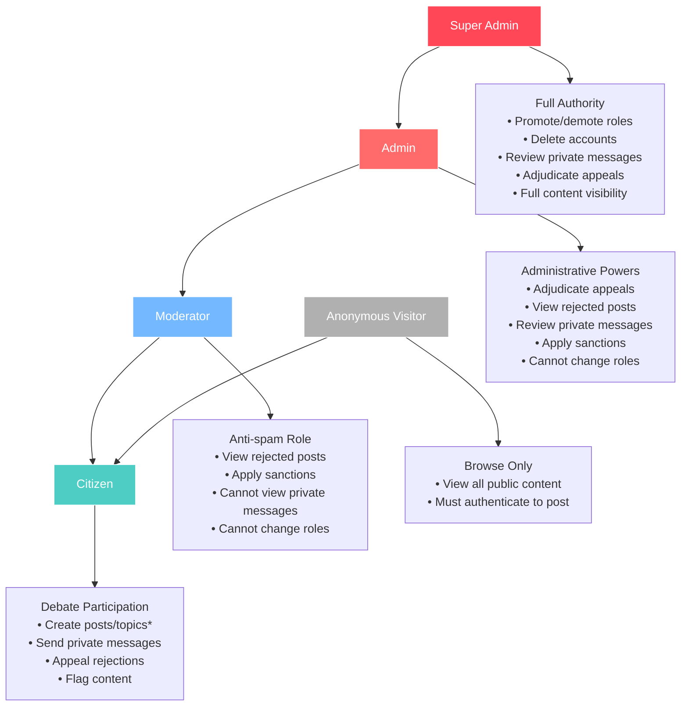
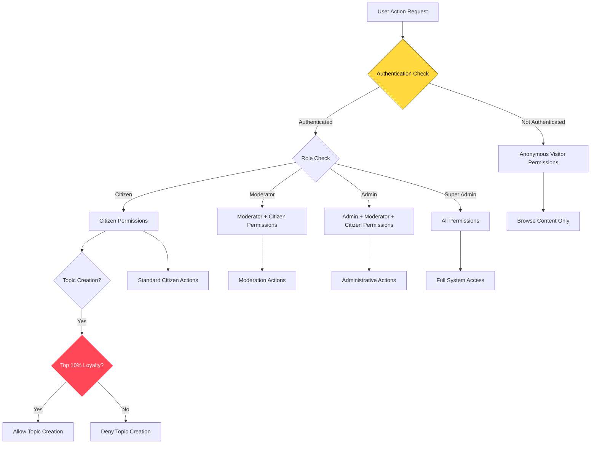

# Roles and Capabilities

## Role Hierarchy Diagram

## Permission Flow

## Role Hierarchy

### Super Admin
- **Full authority**. Can promote and demote roles. Can delete accounts. Can review private messages. Can adjudicate appeals and flags. Full visibility of all logs and content.

### Admin
- Can adjudicate appeals and flags. Can view rejected posts. Can review private messages. Can apply sanctions. Cannot change user roles. Cannot delete accounts.

### Moderator
- **Anti-spam role**. Can view rejected posts. Can sanction citizens to slow or pause posting. Cannot change roles. Cannot delete accounts. Cannot view private messages. Cannot access citizens' hidden personal information.

### Citizen
- Can view and participate in topics. May be eligible to create topics if high-ranked. Can send private messages. Can appeal rejections. Can flag content.

### Anonymous Visitor
- Can browse the application. Can begin composing posts or topics. Must authenticate before submission enters moderation.

## Permission Matrix

| Capability | Anonymous | Citizen | Moderator | Admin | Super Admin |
|------------|-----------|---------|-----------|-------|-------------|
| Browse content | ✓ | ✓ | ✓ | ✓ | ✓ |
| Create posts | - | ✓ | ✓ | ✓ | ✓ |
| Create topics | - | ✓* | ✓ | ✓ | ✓ |
| Send private messages | - | ✓ | ✓ | ✓ | ✓ |
| Appeal rejections | - | ✓ | ✓ | ✓ | ✓ |
| Flag content | - | ✓ | ✓ | ✓ | ✓ |
| View rejected posts | - | Own only | ✓ | ✓ | ✓ |
| Apply sanctions | - | - | ✓ | ✓ | ✓ |
| Adjudicate appeals | - | - | ✓ | ✓ | ✓ |
| View private messages | - | Own only | - | ✓ | ✓ |
| Change user roles | - | - | - | - | ✓ |
| Delete accounts | - | - | - | - | ✓ |

*Topic creation for citizens requires high loyalty ranking (top 10% by loyalty score)

---

**Related Documentation:**
- [Product Vision](./01-product-vision.md) - Core concepts and terminology
- [Gamification & Reputation](./10-gamification-reputation.md) - Loyalty score requirements
- [Technical: RBAC System](../technical-design/08-rbac-permissions.md) - Implementation details
