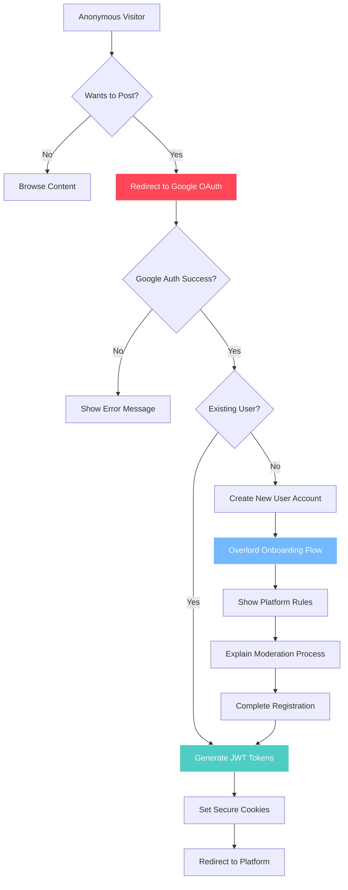
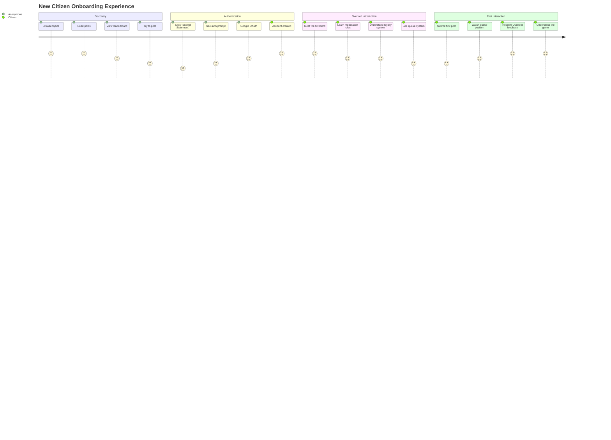

# Authentication, Registration, and Onboarding

## Authentication Flow

## Onboarding User Journey

## Authentication Method

**Single provider. Google only.**

## Anonymous Browsing

The entire application is visible to anonymous visitors, including topics, posts, leaderboard, and registry.

## Onboarding Trigger

If an anonymous visitor attempts to submit a post or create a topic, they are guided through Overlord-narrated onboarding and authentication before anything enters the appropriate evaluation queue.

## Onboarding Content

The Overlord explains:
- That all content is judged for logic and tone.
- That tags are assigned by the Overlord.
- That posts can be approved, calibrated, or rejected.
- That rejected posts can be appealed under limits.

---

**Related Documentation:**
- [Look & Feel](./03-look-feel.md) - Overlord voice and tone
- [Posts & Moderation](./07-posts-moderation.md) - Evaluation process
- [Technical: Authentication](../technical-design/03-authentication.md) - Implementation details
