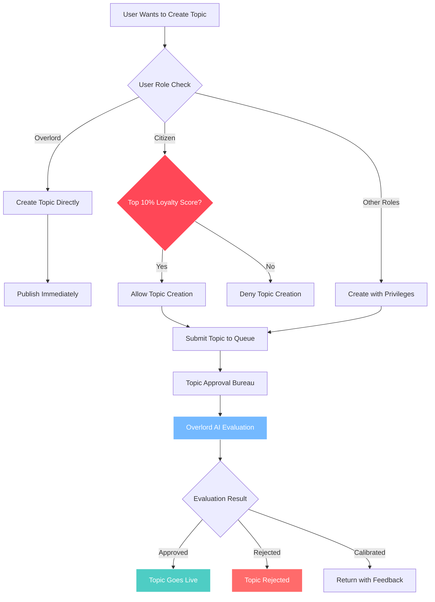
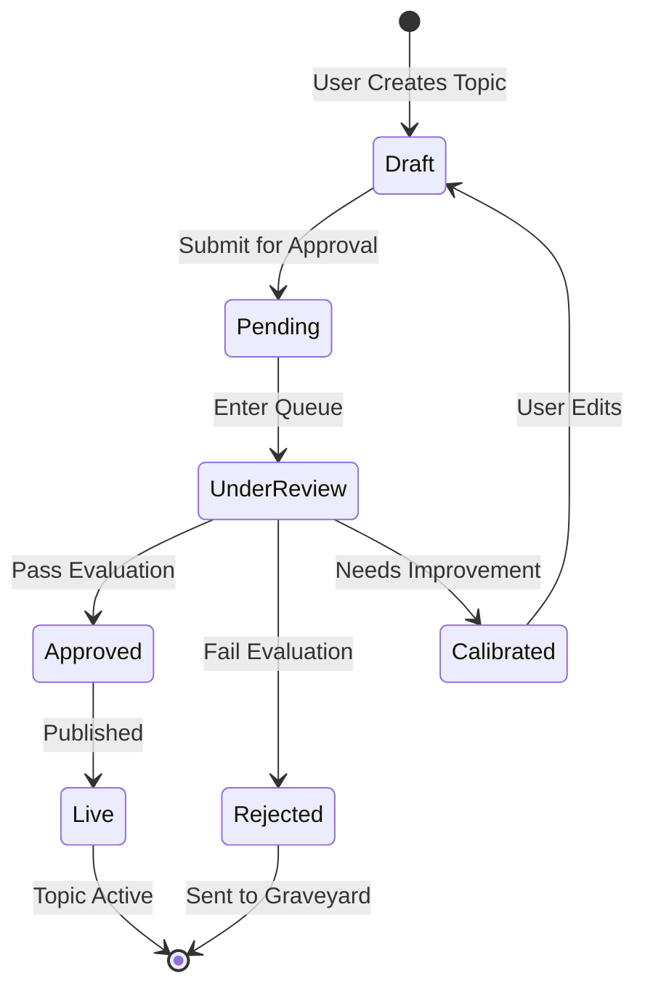

# Topics

## Topic Creation Flow

## Topic Lifecycle

## Who Can Create Topics

### The Overlord
The Overlord can create topics at will.

### Citizens
Citizens can create topics only if they are among the most loyal, as determined by the leaderboard. The exact threshold is the **top 10% of citizens by loyalty score**, calculated in real-time.

## Approval Process

- **Fully automatic via Overlord (LLM)**. No manual admin approval required for MVP.
- Uses same evaluation criteria as posts: logic, tone, relevance.

## Topic Fields

- **Title**
- **Description** 
- **Author**
- **Overlord-assigned tags**

## Behavior

Topics list appears in a simple feed. Sorting and filtering use search and tags. **No score voting**.

---

**Related Documentation:**
- [Roles & Capabilities](./02-roles-capabilities.md) - Topic creation permissions
- [Gamification & Reputation](./10-gamification-reputation.md) - Loyalty score thresholds
- [Overlord Behavior](./09-overlord-behavior.md) - Evaluation criteria
- [Technical: Database Schema](../technical-design/05-database-schema.md) - Topics table structure
