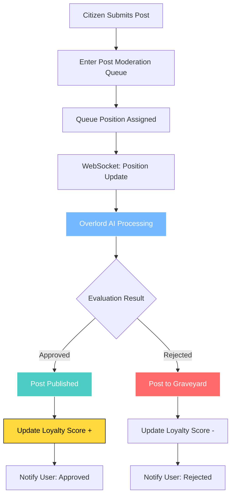
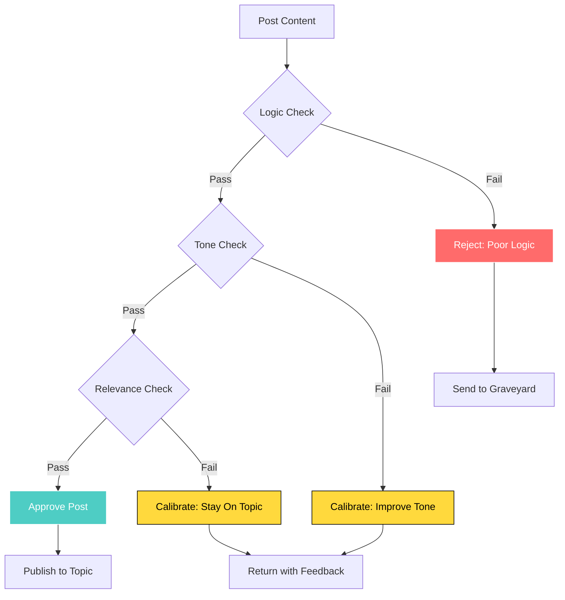

# Posts and Replies

## Post Moderation Flow

## Moderation Decision Tree

## Submission

- Citizens can reply in any topic.
- Posts are displayed in **chronological order by submission time**. There are no upvotes or downvotes.
- Posts may be processed out of submission order for performance optimization, but final display always uses submission timestamp ordering.

## Evaluation

### Specialized Evaluation Queues

Submissions enter specialized evaluation queues based on content type:

- **Topic Creation Queue**: Global queue for all new topic proposals
- **Post Moderation Queues**: Per-topic queues for posts within specific debates
- **Private Message Queues**: Per-conversation queues for private communications (processed sequentially to guarantee delivery order)

### Queue System Visualization

The queue system is rendered as a dynamic pneumatic tube network with branching paths. Each queue type has distinct visual styling and capsule colors.

Queue updates are live and show real-time movement through the tube system, representing processing activity rather than final display order.

### In-Character Commentary

While content is waiting, the Overlord can stream in-character commentary to the author.

## Evaluation Outcomes

### Approved
The post appears in the topic. The Overlord may attach a visible commentary block.

### Rejected
The post does not appear publicly. It is stored in the author's private **Graveyard** and visible to the author, moderators, admins, and super admins.

---

**Related Documentation:**
- [Queue Visualization](./16-queue-visualization.md) - Detailed queue requirements
- [Overlord Behavior](./09-overlord-behavior.md) - Evaluation criteria
- [Appeals & Reporting](./12-appeals-reporting.md) - Appeal process for rejections
- [Technical: Real-time Streaming](../technical-design/06-realtime-streaming.md) - Implementation details
