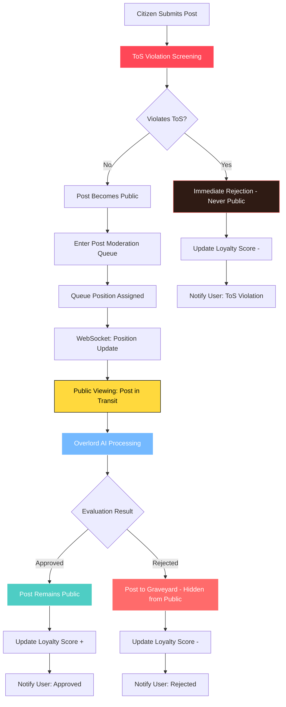
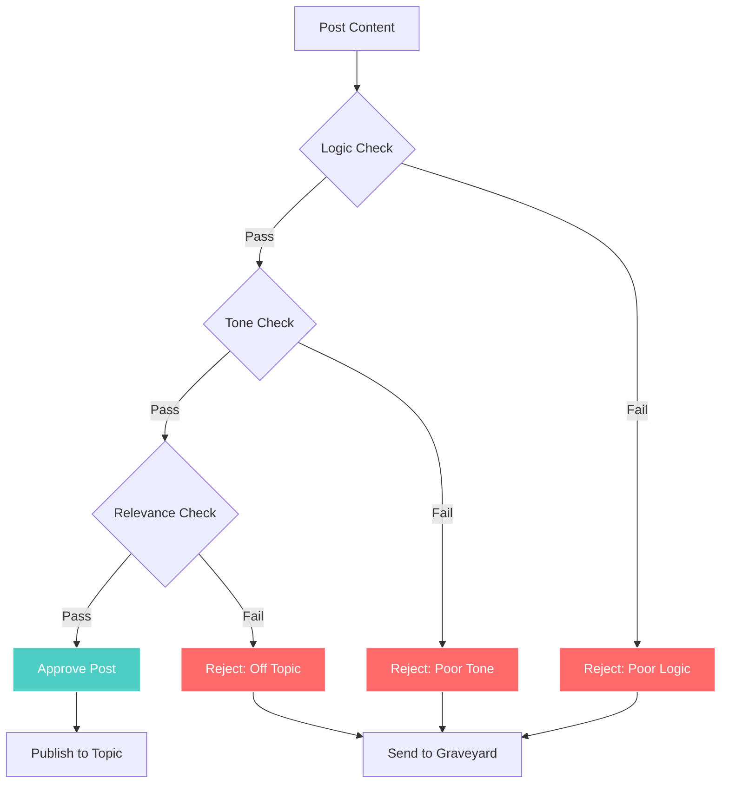

# Posts and Replies

## Post Moderation Flow

## Moderation Decision Tree

## Submission & Public Spectacle

- Citizens may submit arguments for the Robot Overlord's evaluation in any approved topic.
- **Posts undergo immediate ToS violation screening** using a fast, cost-effective LLM checkpoint to prevent offensive or illegal content from ever appearing publicly.
- **Posts that pass ToS screening become immediately visible to all citizens** - creating a public spectacle as they journey through the pneumatic tubes toward judgment.
- Citizens can watch posts travel through the evaluation queue, building tension and anticipation for the Robot Overlord's verdict.
- Posts are displayed in **chronological order by submission time**. There are no upvotes or downvotes - only the Overlord's judgment matters.
- Posts may be processed out of submission order for performance optimization, but final display always uses submission timestamp ordering to maintain proper debate flow.

## Evaluation

### Specialized Evaluation Queues

Submissions enter specialized evaluation queues based on content type:

- **Topic Creation Queue**: Global queue for all new topic proposals
- **Post Moderation Queues**: Per-topic queues for posts within specific debates
- **Private Message Queues**: Per-conversation queues for private communications (processed sequentially to guarantee delivery order)

### Queue System Visualization

The queue system is rendered as a dynamic pneumatic tube network with branching paths. Each queue type has distinct visual styling and capsule colors.

Queue updates are live and show real-time movement through the tube system, representing processing activity rather than final display order.

### In-Character Commentary

While content is waiting, the Overlord can stream in-character commentary to the author.

## Evaluation Outcomes

### ToS Violation (Pre-Public)
The post is immediately rejected before ever becoming public. Stored in the author's private **Graveyard** with a ToS violation notice. Never visible to other citizens.

### Approved
The post remains publicly visible in the topic where it was already displayed during evaluation. The Overlord may attach a visible commentary block celebrating the citizen's contribution.

### Rejected (Post-Public)
The post is immediately **removed from public view** and buried in the author's private **Graveyard**. Citizens who were watching the post's journey witness its sudden disappearance - a public demonstration of the Overlord's authority. The rejected post remains visible only to the author, moderators, admins, and super admins.

---

**Related Documentation:**
- [Queue Visualization](./16-queue-visualization.md) - Detailed queue requirements
- [Overlord Behavior](./09-overlord-behavior.md) - Evaluation criteria
- [Appeals & Reporting](./12-appeals-reporting.md) - Appeal process for rejections
- [Technical: Real-time Streaming](../technical-design/06-realtime-streaming.md) - Implementation details
