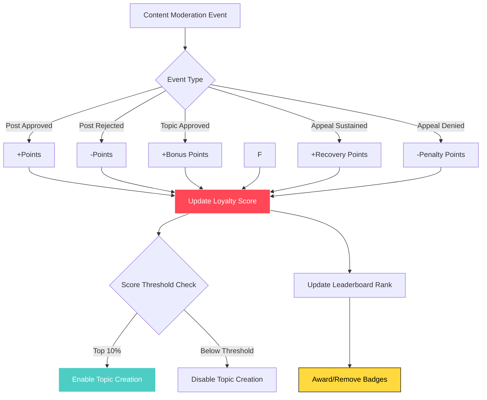
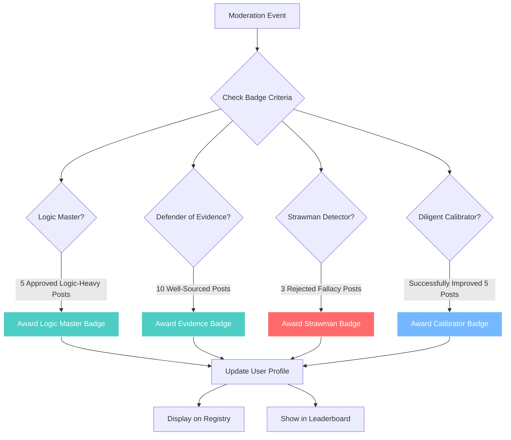

# Gamification and Public Reputation

## Loyalty Score System

## Badge Award System

## Loyalty Score

### Definition
Calculated using a proprietary algorithm based on moderation outcomes across all content types. General factors are disclosed to users (approved/rejected post ratios), but specific weights and calculations remain proprietary.

### Updates
Real-time calculation with no caching needed for MVP.

### Storage
Stored in users table and recalculated on each moderation outcome.

### Scope
Public. Shown on profile, registry, and leaderboard. The only public reputation metric.

## Leaderboard

- Global leaderboard shows all citizens, ordered by Loyalty Score. Every citizen can see their rank.
- Topic creation privilege uses a high-rank threshold.

## Badges

### Positive Examples
- Master of Logic
- Defender of Evidence
- Diligent Calibrator

### Negative Examples
- Strawman
- Ad Hominem
- Illogical

Badges appear publicly on profile and in the registry.

---

**Related Documentation:**
- [Topics & Content Creation](./06-topics-content.md) - Loyalty score requirements for topic creation
- [Citizen Profiles & Registry](./11-profiles-registry.md) - Badge display
- [Technical: Event-Driven Loyalty System](../technical-design/09-loyalty-scoring.md) - Implementation details
