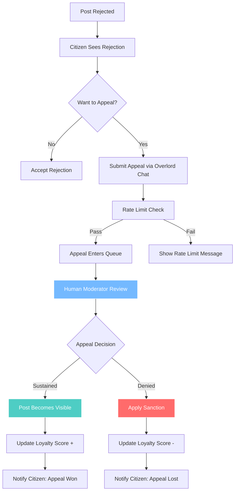
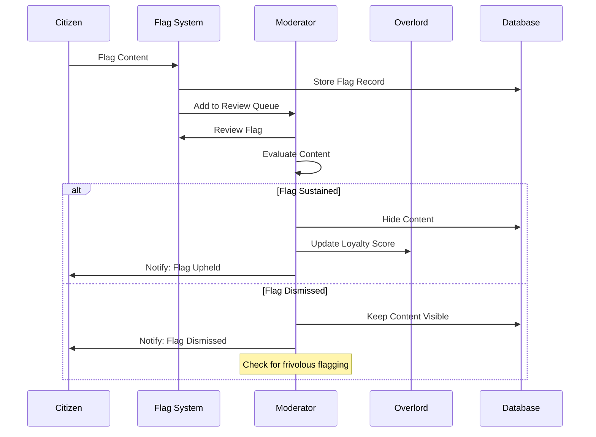

# Appeals and Reporting

## Appeals Process Flow

## Reporting & Flagging Flow

## Appeals

### Eligibility
Any rejected public post can be appealed by its author.

### Submission Process
Citizens submit appeals via chat with the Robot Overlord, following proper bureaucratic protocol.

### Confirmation
The Robot Overlord confirms receipt with characteristic bureaucratic precision and enters appeal into the state processing queue.

### Review Process
Appeals reviewed outside of chat in dedicated dashboard (Phase 4).

### Rate Limits
One appeal submission per citizen per five minutes.

### Reviewers
Moderators, admins, and super admins can adjudicate appeals.

### Outcomes
- **If sustained**: The post becomes visible and all stats update.
- **If denied**: A sanction is applied to discourage frivolous appeals.

### Delay Messaging
If queues are backed up: "Your petition has been logged. Await review by the Central Committee."

## Reporting

### Flagging Process
Any citizen can flag a post or topic for review.

### Review Queue
Flags enter dedicated moderation queues and are adjudicated by moderators, admins, and super admins.

### Outcomes
If a flag is sustained, the content is hidden and counted as a rejection with stats updated. Repeated frivolous flagging results in sanctions.

---

**Related Documentation:**
- [Sanctions & Moderation](./13-sanctions-moderation.md) - Sanction system
- [Guidelines & Help](./14-guidelines-help.md) - Appeal submission via Overlord chat
- [Technical: API Design](../technical-design/04-api-design.md) - Appeals endpoints
