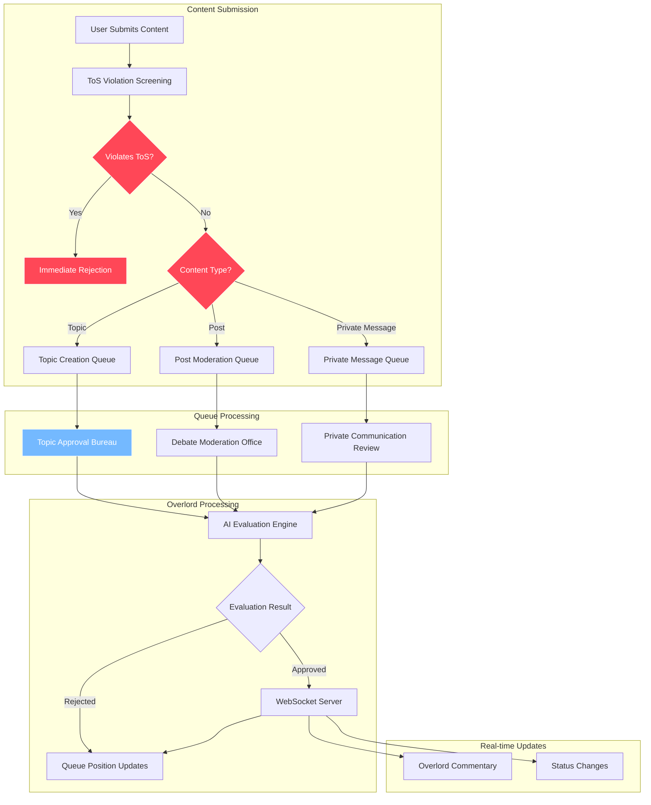
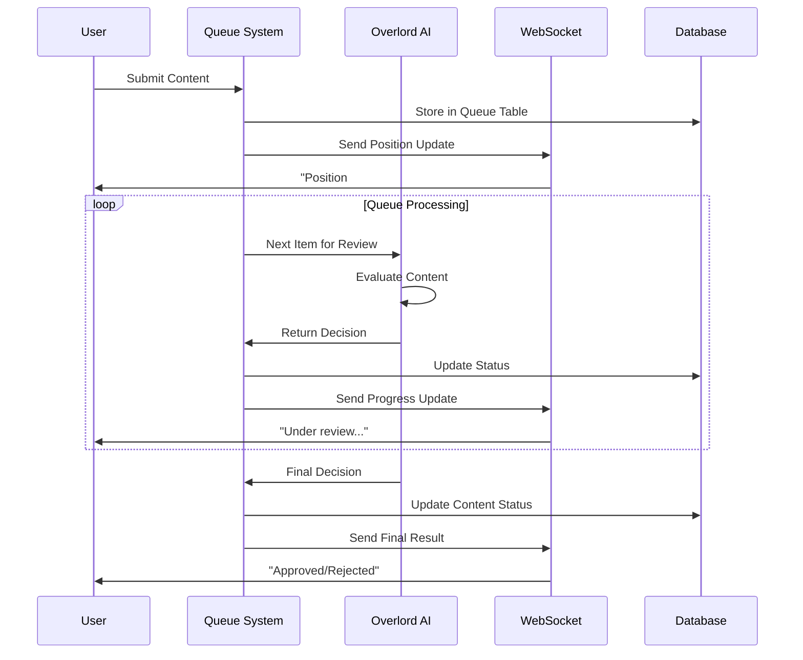

# Queue Status System

## Concept

Clear, honest communication about queue position and estimated wait times through status cards and Overlord commentary. **Posts undergo immediate ToS violation screening before becoming public** - only content that passes this checkpoint becomes visible to citizens, creating a safe public spectacle as they journey through the pneumatic tubes toward the Robot Overlord's judgment. Citizens can watch the drama unfold as posts await their fate.

## Queue System Architecture



## Queue Flow Visualization



## Queue Status Cards

Each queue item displays:
- **Position in queue** (e.g., "Position 3 of 12") - reflects true FIFO processing order
- **Estimated wait time** based on historical processing rates
- **Current status** (Pending, In Review, Processing)
- **Overlord commentary** providing context or encouragement
- **Fair processing guarantee** - "All submissions processed in order received"

### Topic Approval Bureau
```
┌─────────────────────────────────┐
│ 🏛️ TOPIC APPROVAL BUREAU        │
│ Your submission: Position #3     │
│ Estimated review: 2-4 minutes   │
│ Current status: Under review     │
└─────────────────────────────────┘
```

### Debate Moderation Office
```
┌─────────────────────────────────┐
│ 📝 CLIMATE CHANGE DEBATE        │
│ Your post: Position #7          │
│ Estimated review: 5-8 minutes   │
│ Current status: Awaiting review │
└─────────────────────────────────┘
```

### Private Communication Review
```
┌─────────────────────────────────┐
│ 🔒 PRIVATE MESSAGE REVIEW       │
│ Your message: Position #2       │
│ Estimated review: 1-3 minutes   │
│ Current status: Under review     │
└─────────────────────────────────┘
```

## Overlord Commentary System

### Progressive Status Updates
- **Initial**: "Citizen, your submission has been logged. Position #3 in the queue."
- **Processing**: "The Committee is now reviewing your proposal. Maintain patience."
- **Near completion**: "Your reasoning shows promise. Final evaluation in progress..."

### Context-Aware Messages
Commentary varies based on queue position, wait time, and submission type while maintaining authoritarian character. **Citizens watching posts in transit** may also receive commentary about the spectacle unfolding before them.

## The Overlord's Commentary:
"Citizen, your submission awaits my divine attention. The queue moves in perfect order - first submitted, first reviewed. No favoritism, no shortcuts, no hidden priorities. Your patience demonstrates loyalty to the fair system I have decreed."
- **Processing**: "The Committee is now reviewing your proposal. Maintain patience."
- **Near completion**: "Your reasoning shows promise. Final evaluation in progress..."

## Public Queue Overview & Spectacle

### Live Post Viewing
- **All submitted posts are immediately visible to all citizens** during their journey through evaluation
- Citizens can watch posts travel through the pneumatic tube system in real-time
- **Tension builds** as citizens see posts they agree/disagree with approaching judgment
- **Public celebrations and disappointments** occur when the Robot Overlord renders verdicts

### Aggregate Statistics
- Total items in each queue
- Estimated wait times for new submissions
- General processing status without individual details

### Anonymous Visibility
All users can see queue lengths, general activity, and **all posts currently in evaluation** without needing authentication.

---

**Related Documentation:**
- [Posts & Moderation](./07-posts-moderation.md) - Queue system overview
- [Look & Feel](./03-look-feel.md) - Visual design principles
- [Technical: Real-time Streaming](../technical-design/06-realtime-streaming.md) - Implementation details
