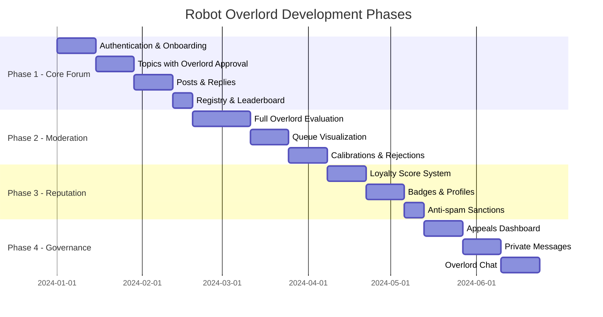
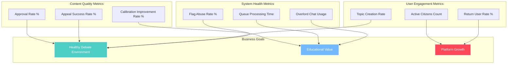

# Success Metrics & Delivery

## Project Delivery Timeline

## Success Metrics Dashboard

## Success Signals

- A healthy ratio of approved to rejected posts over time.
- Meaningful appeals rate and resolution time.
- Growth in active citizens who return to debate.
- Discoverability measured by Overlord chat usage and tag navigation.
- Low abuse of flags and appeals after sanctions are introduced.

## Phased Delivery

### Phase 1. Core Forum
Authentication and onboarding. Topics with Overlord approvals. Posts and replies. Chronological ordering. Minimal Overlord commentary. Registry and leaderboard scaffolding.

### Phase 2. Moderation
Full Overlord evaluation across specialized queue types. Real-time multi-queue visualization with dynamic tube network. Calibrations and rejections with feedback.

### Phase 3. Reputation
Loyalty Score, global leaderboard, badges, profiles with activity list and tag cloud. Anti-spam sanctions.

### Phase 4. Governance and Discovery
Appeals and reporting dashboard. Private messages with moderation and audit rules. Overlord chat for rules and discovery.

## Out of Scope for Launch

- Seasonal events. None for now.
- Sub-communities or folders. Not planned. Tags provide organization.
- Rich profile customization. No bios. No avatars.
- Voting and karma mechanics. Not used.

---

**Related Documentation:**
- [Gamification & Reputation](./10-gamification-reputation.md) - Loyalty scoring system
- [Queue Visualization](./16-queue-visualization.md) - Phase 2 visualization requirements
- [Technical: Project Roadmap](../technical-design/11-project-roadmap.md) - Implementation phases
