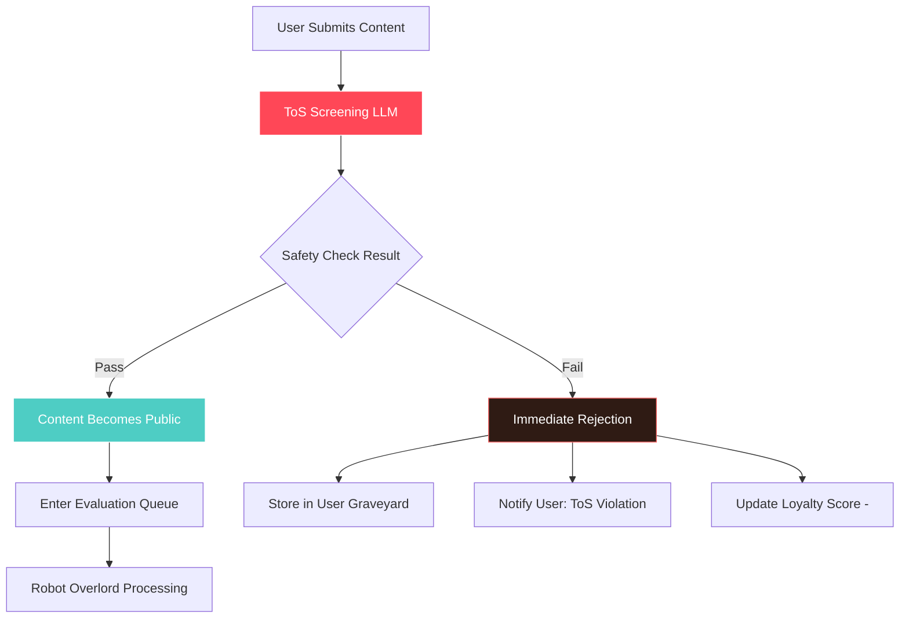

# Content Safety & ToS Screening

## Overview

All user-generated content undergoes immediate Terms of Service (ToS) violation screening before becoming publicly visible. This ensures no offensive, illegal, or harmful content appears on the platform, even temporarily.

## ToS Screening Process

### Fast LLM Checkpoint
- **Purpose**: Prevent offensive/illegal content from ever becoming public
- **Implementation**: Lightweight, cost-effective LLM model optimized for speed
- **Scope**: All posts, topics, and private messages before public visibility
- **Response Time**: Sub-second screening to maintain user experience

### Screening Criteria
- **Illegal Content**: Threats, harassment, doxxing, illegal activities
- **Offensive Material**: Hate speech, explicit content, spam
- **Platform Violations**: Off-topic spam, promotional content, bot behavior
- **Safety Concerns**: Self-harm content, dangerous instructions

## Content Flow with Safety

## Safety Outcomes

### Content Passes Screening
- Immediately becomes publicly visible
- Enters normal evaluation queue for Robot Overlord judgment
- Citizens can watch its journey through the pneumatic tubes

### Content Fails Screening
- **Never becomes public** - no other citizens see it
- Stored in author's private Graveyard with ToS violation notice
- Loyalty score penalty applied
- Author receives notification with violation reason

## Appeals Process

### ToS Violation Appeals
- Citizens can appeal ToS violations through the standard appeals process
- Appeals reviewed by human moderators, not the Robot Overlord
- If sustained, content may be re-evaluated by the Robot Overlord
- If denied, additional sanctions may apply for frivolous appeals

## Technical Implementation

### LLM Selection
- Prioritize speed and cost-effectiveness over nuanced evaluation
- Simple binary classification: "Safe for public viewing" vs "ToS violation"
- Leave complex logic/tone/relevance evaluation to the Robot Overlord

### Fallback Mechanisms
- If ToS screening fails/times out, content defaults to **rejected** (safe default)
- Manual review queue for edge cases
- Regular model updates based on moderation patterns

---

**Related Documentation:**
- [Posts & Moderation](./07-posts-moderation.md) - Full moderation flow
- [Appeals & Reporting](./12-appeals-reporting.md) - Appeal process
- [Overlord Behavior](./09-overlord-behavior.md) - Main evaluation criteria
- [Technical: AI/LLM Integration](../technical-design/07-ai-llm-integration.md) - Implementation details
