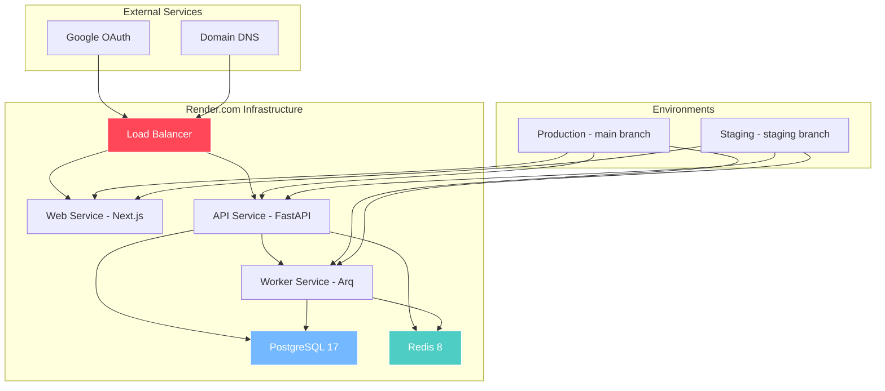
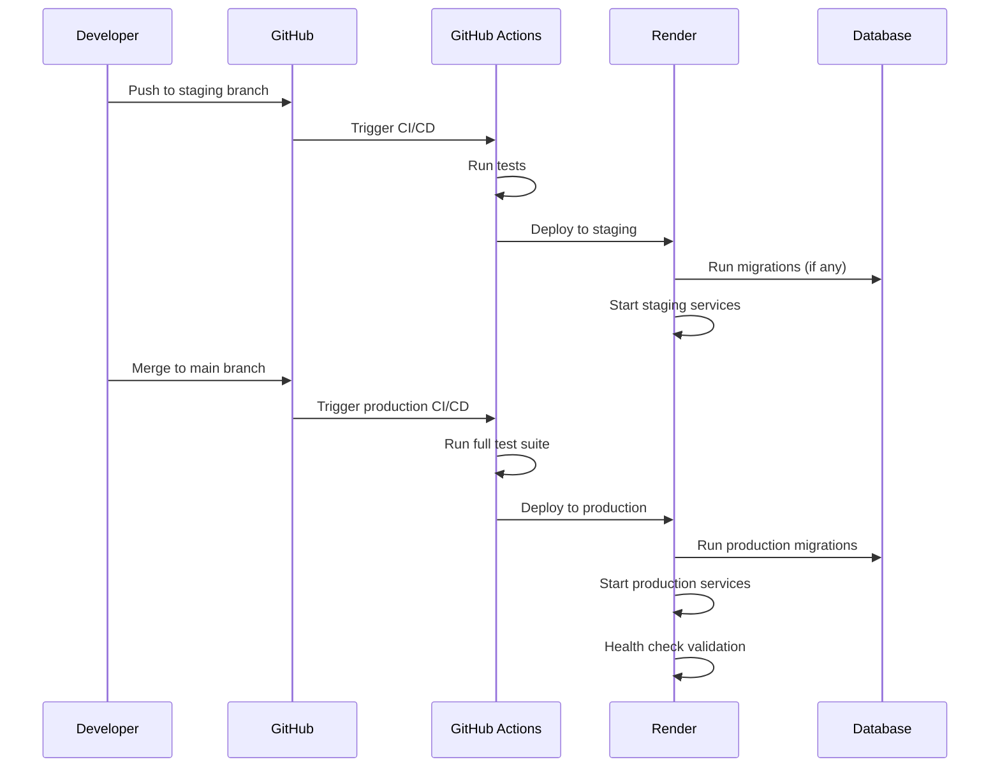

# Deployment and Infrastructure

## Infrastructure Architecture

## Deployment Pipeline

## Hosting Provider

**Render.com**

## Environments

- **Staging**: `staging` branch → staging environment
- **Production**: `main` branch → production environment

## Branch Mapping & Promotion

- GitHub Actions deploy latest commit of branch
- Promotion can be by merging `staging` → `main`, or direct hotfix to `main`

## Services on Render

### API Service
FastAPI backend

### Web Service
Next.js frontend

### Worker Service
Dedicated background worker service for async jobs (Arq)

### Database
Managed PostgreSQL 17 with extensions enabled: `pgvector`, `citext`

### Redis
Self-hosted Redis 8 on Render private service with persistent disk

**Used for:**
- Queues
- Caching
- Semantic cache
- Redis Streams for job streaming

## Domains

### Frontend
- **Production**: `therobotoverlord.com`, `www.therobotoverlord.com`
- **Staging**: `staging.therobotoverlord.com`

### API
- **Production**: `api.therobotoverlord.com`
- **Staging**: `api.staging.therobotoverlord.com`

## CORS Policy

API only accepts requests from frontend origins (`therobotoverlord.com`, `www.therobotoverlord.com`, `staging.therobotoverlord.com`).

---

**Related Documentation:**
- [Background Processing](./11-background-processing.md) - Worker service details
- [Database Schema](./05-database-schema.md) - PostgreSQL configuration
- [Business: Success & Delivery](../business-requirements/19-success-delivery.md) - Deployment phases
