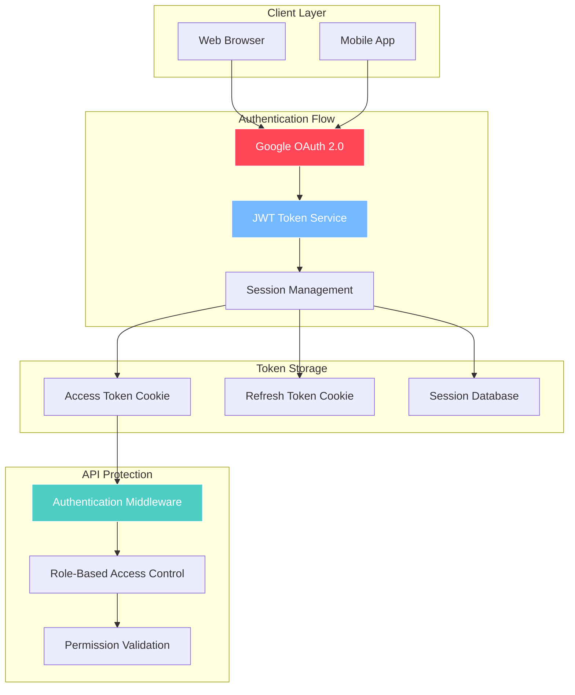
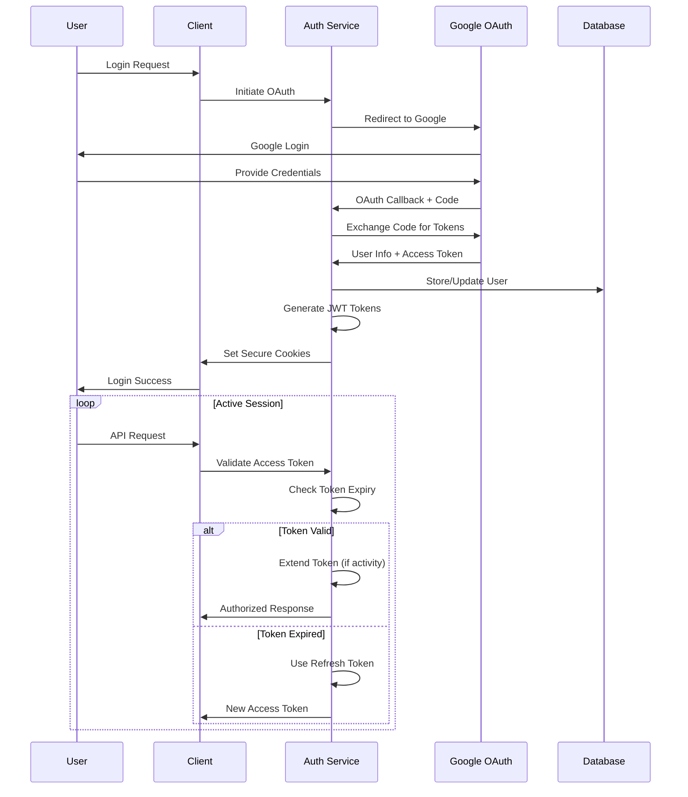

# Authentication

## Authentication System Architecture

## Token Lifecycle Management

## JWT-Based Authentication

### Token Lifetimes
- **Access Token**: 1 hour base lifetime, extendable to 8 hours maximum
- **Refresh Token**: 14 days

### Activity-Based Token Extension Strategy
- Access tokens extend by 30 minutes per user activity
- Maximum token lifetime: 8 hours from initial issue
- Extension triggers: API calls, WebSocket activity, page navigation
- Refresh token rotation on each use
- Secure httpOnly cookies for token storage

## Access Tokens

- **Storage**: httpOnly, Secure cookie (`__Secure-trl_at`)
- **Domain**: `.therobotoverlord.com`
- **Path**: `/`
- **SameSite**: Lax
- **Base Expiration**: 1 hour from issue
- **Activity Extension**: +30 minutes per activity, max 8 hours total
- **Extension Triggers**: API requests, WebSocket messages, page navigation

## Refresh Tokens

- **Lifetime**: 14 days
- **Storage**: httpOnly, Secure cookie (`__Secure-trl_rt`)
- **Domain**: `.therobotoverlord.com`
- **Path**: `/`
- **SameSite**: Lax
- **Rotation**: Rotated on every refresh, reuse detection enabled
- **Persistence**: Stored in PostgreSQL with device metadata (session_id, rotated_at, last_used_ip, last_used_user_agent, revoked, reuse_detected)

## JWT Claims

### Standard Claims
`iss`, `aud`, `iat`, `exp`, `nbf`

### Custom Claims
- `sub`: user UUID
- `role`: citizen, moderator, admin, superadmin
- `sid`: stable session id per device
- `authz_ver`: bumped on role/ban changes
- `permissions`: array of permission names (e.g., ["create_topics", "moderate_posts"])
- `scopes`: array (reserved for future use)

**No email in tokens** (lookup via `sub` when needed)

## Key Management

- Start with manual asymmetric keypair in Render secrets
- API exposes JWKS endpoint with `kid`
- Design allows future migration to KMS without breaking validation

## Login

- Direct Google OAuth2 integration
- Anyone with a Google account may register/login
- Require `email_verified=true`

---

**Related Documentation:**
- [Business: Authentication & Onboarding](../business-requirements/05-auth-onboarding.md) - User experience flow
- [RBAC & Permissions](./08-rbac-permissions.md) - Permission system details
- [API Design](./04-api-design.md) - Authentication endpoints
