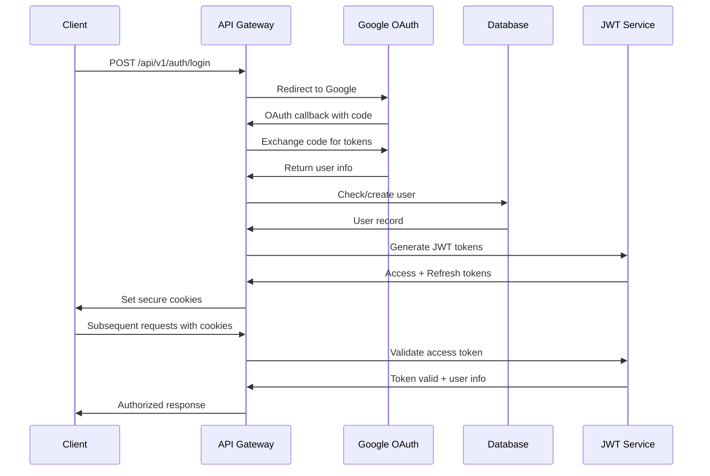
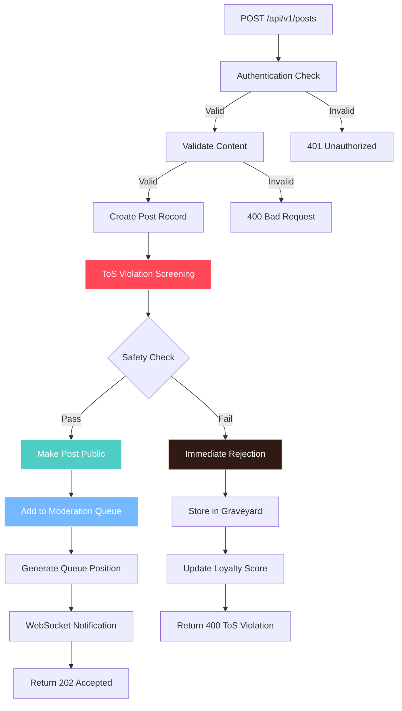

# API Design

## API Architecture Overview

```mermaid
graph TD
    subgraph "Client Layer"
        A[Web Frontend]
        B[Mobile App]
        C[Admin Dashboard]
    end
    
    subgraph "API Gateway"
        D[FastAPI Router]
        E[Authentication Middleware]
        F[Rate Limiting]
        G[CORS Handler]
    end
    
    subgraph "Domain Routers"
        H[/auth]
        I[/users]
        J[/topics]
        K[/posts]
        L[/moderation]
        M[/queue]
    end
    
    subgraph "Services"
        N[Auth Service]
        O[Content Service]
        P[Moderation Service]
        Q[Queue Service]
        R[Notification Service]
    end
    
    A --> D
    B --> D
    C --> D
    
    D --> E
    E --> F
    F --> G
    G --> H
    G --> I
    G --> J
    G --> K
    G --> L
    G --> M
    
    H --> N
    I --> O
    J --> O
    K --> O
    L --> P
    M --> Q
    
    style D fill:#ff4757,stroke:#fff,color:#fff
    style N fill:#74b9ff,stroke:#fff,color:#fff
    style P fill:#4ecdc4,stroke:#fff,color:#fff
```

## Authentication Flow



## Content Submission API Flow



## Routing

- **Modular routers by domain** (`auth`, `users`, `topics`, `posts`, `moderation`)
- Mounted under `/api/v1`

## Response Format

### Pydantic Models for API Responses

```python
from pydantic import BaseModel
from typing import Any, Optional, Dict
from enum import Enum

class ResponseStatus(str, Enum):
    OK = "ok"
    ERROR = "error"

class ErrorCode(str, Enum):
    UNAUTHORIZED = "UNAUTHORIZED"
    FORBIDDEN = "FORBIDDEN"
    NOT_FOUND = "NOT_FOUND"
    CONFLICT = "CONFLICT"
    BAD_REQUEST = "BAD_REQUEST"
    RATE_LIMITED = "RATE_LIMITED"
    VALIDATION_ERROR = "VALIDATION_ERROR"
    INTERNAL_ERROR = "INTERNAL_ERROR"
    TOS_VIOLATION = "TOS_VIOLATION"

class APIError(BaseModel):
    code: ErrorCode
    message: str
    details: Dict[str, Any] = {}
    trace_id: str

class APIResponse(BaseModel):
    status: ResponseStatus
    data: Optional[Any] = None
    meta: Optional[Dict[str, Any]] = None
    error: Optional[APIError] = None
```

## API Endpoints

### Authentication Endpoints (`/api/v1/auth/`)

- `POST /login` - Google OAuth login (includes onboarding for new users)
- `POST /refresh` - Refresh access token
- `POST /logout` - Invalidate tokens
- `POST /revoke` - Revoke all sessions for a user
- `GET /jwks` - Public key for JWT verification
- `GET /me` - Get current user info

### Topics Endpoints (`/api/v1/topics/`)

- `GET /` - List topics (with search/tag filtering)
- `POST /` - Create topic (citizens with permission only)
- `GET /{topic_id}` - Get topic details
- `GET /{topic_id}/posts` - Get posts in topic (paginated, chronological by submitted_at)

### Posts Endpoints (`/api/v1/posts/`)

- `POST /` - Submit new post/reply (includes ToS screening)
- `GET /{post_id}` - Get specific post
- `POST /{post_id}/appeal` - Appeal rejected post (including ToS violations)
- `POST /{post_id}/flag` - Flag post for review
- `GET /in-transit` - Get all posts currently in evaluation queues (public endpoint)

### Public Endpoints

- `GET /api/v1/queue/status/{submission_id}` - Get queue status for specific submission
- `GET /api/v1/queue/overview` - Public queue overview (lengths only)
- `GET /api/v1/users/{user_id}/profile` - Public user profile
- `GET /api/v1/leaderboard` - Global leaderboard

### WebSocket Endpoints

- `WS /api/v1/overlord/chat` - Real-time chat with Overlord (includes queue status updates)

---

**Related Documentation:**
- [Authentication](./03-authentication.md) - JWT implementation details
- [Real-time Streaming](./06-realtime-streaming.md) - WebSocket implementation
- [Business: Topics & Content](../business-requirements/06-topics-content.md) - Topic creation rules
