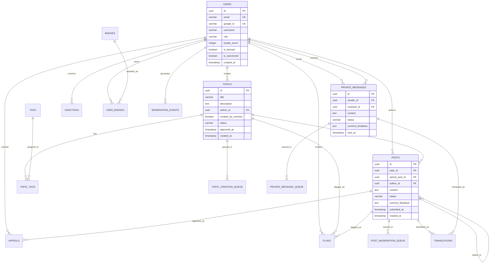
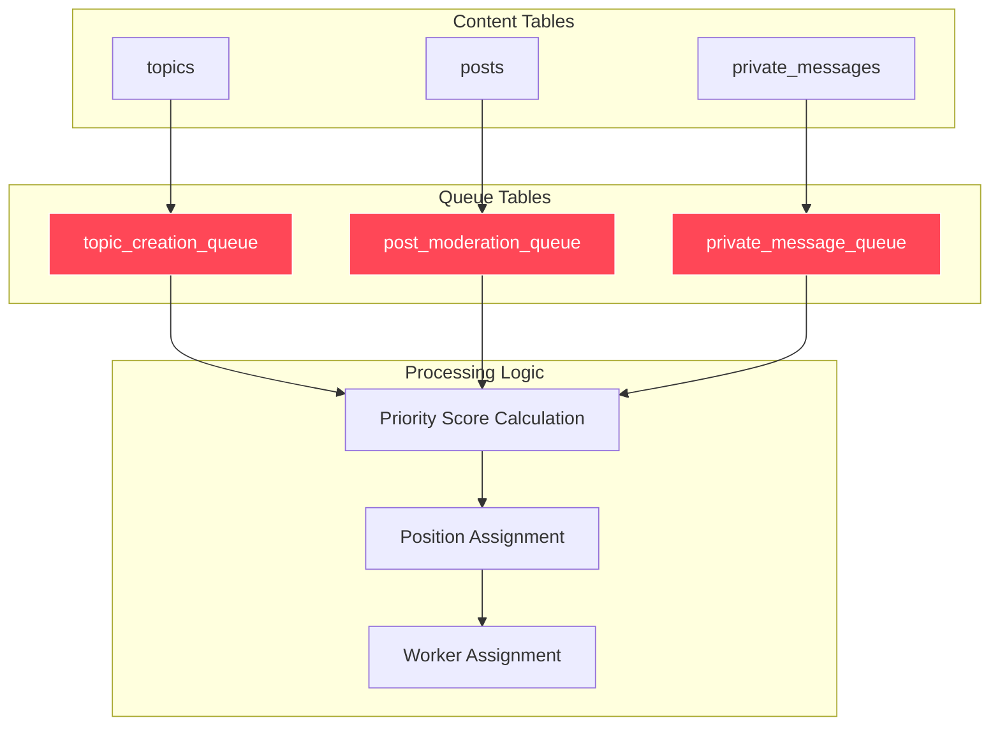
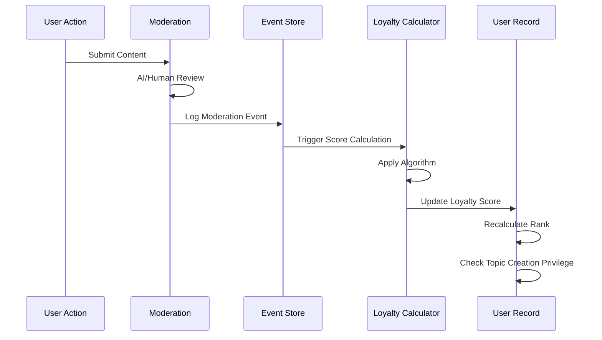

# Database Schema

## Database Entity Relationship Diagram



## Queue System Architecture



## Loyalty Scoring Event Flow



## Database Configuration

- **PostgreSQL 17** (Render managed)
- **Extensions enabled**: `pgvector`, `citext`
- **Database Access**: Raw SQL with asyncpg
- **Migrations**: Custom migration system

## Core Tables

### Users Table

```sql
CREATE TABLE users (
    id UUID PRIMARY KEY DEFAULT gen_random_uuid(),
    email VARCHAR(255) NOT NULL UNIQUE,
    google_id VARCHAR(255) NOT NULL UNIQUE,
    username VARCHAR(100) NOT NULL,
    role VARCHAR(20) NOT NULL CHECK (role IN ('citizen', 'moderator', 'admin', 'superadmin')),
    loyalty_score INTEGER DEFAULT 0, -- Cached score from proprietary algorithm, only public metric
    is_banned BOOLEAN DEFAULT FALSE,
    is_sanctioned BOOLEAN DEFAULT FALSE,
    email_verified BOOLEAN DEFAULT FALSE,
    created_at TIMESTAMP WITH TIME ZONE DEFAULT NOW(),
    updated_at TIMESTAMP WITH TIME ZONE DEFAULT NOW()
);
```

### Topics Table

```sql
CREATE TABLE topics (
    id UUID PRIMARY KEY DEFAULT gen_random_uuid(),
    title VARCHAR(500) NOT NULL,
    description TEXT NOT NULL,
    author_id UUID REFERENCES users(id) ON DELETE SET NULL,
    created_by_overlord BOOLEAN DEFAULT FALSE,
    status VARCHAR(20) NOT NULL CHECK (status IN ('pending_approval', 'approved', 'rejected')),
    approved_at TIMESTAMP WITH TIME ZONE,
    approved_by UUID REFERENCES users(id),
    created_at TIMESTAMP WITH TIME ZONE DEFAULT NOW(),
    updated_at TIMESTAMP WITH TIME ZONE DEFAULT NOW()
);
```

### Posts Table

```sql
CREATE TABLE posts (
    id UUID PRIMARY KEY DEFAULT gen_random_uuid(),
    topic_id UUID NOT NULL REFERENCES topics(id) ON DELETE CASCADE,
    parent_post_id UUID REFERENCES posts(id) ON DELETE CASCADE,
    author_id UUID NOT NULL REFERENCES users(id) ON DELETE CASCADE,
    content TEXT NOT NULL, -- Canonical English storage only
    status VARCHAR(20) NOT NULL CHECK (status IN ('pending', 'approved', 'rejected')),
    overlord_feedback TEXT,
    submitted_at TIMESTAMP WITH TIME ZONE DEFAULT NOW(), -- Used for chronological display ordering
    created_at TIMESTAMP WITH TIME ZONE DEFAULT NOW(),
    updated_at TIMESTAMP WITH TIME ZONE DEFAULT NOW(),
    approved_at TIMESTAMP WITH TIME ZONE
);

-- Indexes for posts
CREATE INDEX idx_posts_topic_submission_order ON posts(topic_id, submitted_at);
```

## Queue Management Tables

### Topic Creation Queue Table

```sql
CREATE TABLE topic_creation_queue (
    id UUID PRIMARY KEY DEFAULT gen_random_uuid(),
    topic_id UUID NOT NULL REFERENCES topics(id) ON DELETE CASCADE,
    priority_score BIGINT NOT NULL, -- Timestamp + priority offset for ordering
    priority INTEGER DEFAULT 0,
    position_in_queue INTEGER NOT NULL, -- Calculated queue position for user display
    status VARCHAR(20) NOT NULL CHECK (status IN ('pending', 'processing', 'completed')) DEFAULT 'pending',
    entered_queue_at TIMESTAMP WITH TIME ZONE DEFAULT NOW(),
    estimated_completion_at TIMESTAMP WITH TIME ZONE,
    worker_assigned_at TIMESTAMP WITH TIME ZONE,
    worker_id VARCHAR(255)
);

-- Indexes for topic_creation_queue
CREATE INDEX idx_topic_queue_priority_score ON topic_creation_queue(priority_score);
CREATE INDEX idx_topic_queue_status ON topic_creation_queue(status);
CREATE INDEX idx_topic_queue_topic ON topic_creation_queue(topic_id);
CREATE INDEX idx_topic_queue_position ON topic_creation_queue(position_in_queue);
```

### Post Moderation Queue Table

```sql
CREATE TABLE post_moderation_queue (
    id UUID PRIMARY KEY DEFAULT gen_random_uuid(),
    post_id UUID NOT NULL REFERENCES posts(id) ON DELETE CASCADE,
    topic_id UUID NOT NULL REFERENCES topics(id) ON DELETE CASCADE,
    priority_score BIGINT NOT NULL, -- Timestamp + priority offset for ordering
    priority INTEGER DEFAULT 0,
    position_in_queue INTEGER NOT NULL, -- Calculated queue position for user display
    status VARCHAR(20) NOT NULL CHECK (status IN ('pending', 'processing', 'completed')) DEFAULT 'pending',
    entered_queue_at TIMESTAMP WITH TIME ZONE DEFAULT NOW(),
    estimated_completion_at TIMESTAMP WITH TIME ZONE,
    worker_assigned_at TIMESTAMP WITH TIME ZONE,
    worker_id VARCHAR(255)
);

-- Indexes for post_moderation_queue
CREATE INDEX idx_post_queue_topic_priority ON post_moderation_queue(topic_id, priority_score);
CREATE INDEX idx_post_queue_status ON post_moderation_queue(status);
CREATE INDEX idx_post_queue_post ON post_moderation_queue(post_id);
CREATE INDEX idx_post_queue_position ON post_moderation_queue(position_in_queue);
```

### Private Message Queue Table

```sql
CREATE TABLE private_message_queue (
    id UUID PRIMARY KEY DEFAULT gen_random_uuid(),
    message_id UUID NOT NULL REFERENCES private_messages(id) ON DELETE CASCADE,
    sender_id UUID NOT NULL REFERENCES users(id) ON DELETE CASCADE,
    recipient_id UUID NOT NULL REFERENCES users(id) ON DELETE CASCADE,
    conversation_id VARCHAR(255) NOT NULL, -- Format: "users_{min_user_id}_{max_user_id}"
    priority_score BIGINT NOT NULL, -- Timestamp + priority offset for ordering
    priority INTEGER DEFAULT 0,
    position_in_queue INTEGER NOT NULL, -- Calculated queue position for user display
    status VARCHAR(20) NOT NULL CHECK (status IN ('pending', 'processing', 'completed')) DEFAULT 'pending',
    entered_queue_at TIMESTAMP WITH TIME ZONE DEFAULT NOW(),
    estimated_completion_at TIMESTAMP WITH TIME ZONE,
    worker_assigned_at TIMESTAMP WITH TIME ZONE,
    worker_id VARCHAR(255)
);

-- Indexes for private_message_queue
CREATE INDEX idx_message_queue_conv_priority ON private_message_queue(conversation_id, priority_score DESC, entered_queue_at ASC);
CREATE INDEX idx_message_queue_status ON private_message_queue(status);
CREATE INDEX idx_message_queue_message ON private_message_queue(message_id);
CREATE INDEX idx_message_queue_conv_position ON private_message_queue(conversation_id, position_in_queue);
```

## Governance Tables

### Appeals Table

```sql
CREATE TABLE appeals (
    id UUID PRIMARY KEY DEFAULT gen_random_uuid(),
    post_id UUID NOT NULL REFERENCES posts(id) ON DELETE CASCADE,
    appellant_id UUID NOT NULL REFERENCES users(id) ON DELETE CASCADE,
    reason TEXT NOT NULL,
    status VARCHAR(20) NOT NULL CHECK (status IN ('pending', 'sustained', 'denied')),
    reviewed_by UUID REFERENCES users(id),
    reviewed_at TIMESTAMP WITH TIME ZONE,
    review_notes TEXT,
    created_at TIMESTAMP WITH TIME ZONE DEFAULT NOW()
);
```

### Flags Table

```sql
CREATE TABLE flags (
    id UUID PRIMARY KEY DEFAULT gen_random_uuid(),
    post_id UUID REFERENCES posts(id) ON DELETE CASCADE,
    topic_id UUID REFERENCES topics(id) ON DELETE CASCADE,
    flagger_id UUID NOT NULL REFERENCES users(id) ON DELETE CASCADE,
    reason TEXT NOT NULL,
    status VARCHAR(20) NOT NULL CHECK (status IN ('pending', 'sustained', 'dismissed')) DEFAULT 'pending',
    reviewed_by UUID REFERENCES users(id),
    reviewed_at TIMESTAMP WITH TIME ZONE,
    review_notes TEXT,
    created_at TIMESTAMP WITH TIME ZONE DEFAULT NOW(),
    
    CONSTRAINT flags_content_check CHECK (
        (post_id IS NOT NULL AND topic_id IS NULL) OR 
        (post_id IS NULL AND topic_id IS NOT NULL)
    )
);

-- Indexes for flags
CREATE INDEX idx_flags_post_id ON flags(post_id) WHERE post_id IS NOT NULL;
CREATE INDEX idx_flags_topic_id ON flags(topic_id) WHERE topic_id IS NOT NULL;
CREATE INDEX idx_flags_flagger_id ON flags(flagger_id);
CREATE INDEX idx_flags_status ON flags(status);
CREATE INDEX idx_flags_reviewed_by ON flags(reviewed_by) WHERE reviewed_by IS NOT NULL;
CREATE INDEX idx_flags_created_at ON flags(created_at);
```

### Sanctions Table

```sql
CREATE TABLE sanctions (
    id UUID PRIMARY KEY DEFAULT gen_random_uuid(),
    user_id UUID NOT NULL REFERENCES users(id) ON DELETE CASCADE,
    type VARCHAR(50) NOT NULL CHECK (type IN ('posting_freeze', 'rate_limit')),
    applied_by UUID NOT NULL REFERENCES users(id),
    applied_at TIMESTAMP WITH TIME ZONE DEFAULT NOW(),
    expires_at TIMESTAMP WITH TIME ZONE,
    reason TEXT NOT NULL,
    is_active BOOLEAN DEFAULT TRUE
);
```

## Additional Tables

### Private Messages Table

```sql
CREATE TABLE private_messages (
    id UUID PRIMARY KEY DEFAULT gen_random_uuid(),
    sender_id UUID NOT NULL REFERENCES users(id) ON DELETE CASCADE,
    recipient_id UUID NOT NULL REFERENCES users(id) ON DELETE CASCADE,
    content TEXT NOT NULL,
    status VARCHAR(20) NOT NULL CHECK (status IN ('pending', 'approved', 'rejected')),
    overlord_feedback TEXT,
    sent_at TIMESTAMP WITH TIME ZONE DEFAULT NOW(),
    approved_at TIMESTAMP WITH TIME ZONE
);
```

### Tags Table

```sql
CREATE TABLE tags (
    id UUID PRIMARY KEY DEFAULT gen_random_uuid(),
    name VARCHAR(100) NOT NULL UNIQUE,
    created_at TIMESTAMP WITH TIME ZONE DEFAULT NOW()
);
```

### Topic_Tags Junction Table

```sql
CREATE TABLE topic_tags (
    topic_id UUID NOT NULL REFERENCES topics(id) ON DELETE CASCADE,
    tag_id UUID NOT NULL REFERENCES tags(id) ON DELETE CASCADE,
    assigned_by UUID NOT NULL REFERENCES users(id),
    assigned_at TIMESTAMP WITH TIME ZONE DEFAULT NOW(),
    PRIMARY KEY (topic_id, tag_id)
);
```

### Badges Table

```sql
CREATE TABLE badges (
    id UUID PRIMARY KEY DEFAULT gen_random_uuid(),
    name VARCHAR(100) NOT NULL UNIQUE,
    description TEXT NOT NULL,
    image_url VARCHAR(500) NOT NULL,
    created_at TIMESTAMP WITH TIME ZONE DEFAULT NOW()
);
```

### User_Badges Junction Table

```sql
CREATE TABLE user_badges (
    user_id UUID NOT NULL REFERENCES users(id) ON DELETE CASCADE,
    badge_id UUID NOT NULL REFERENCES badges(id) ON DELETE CASCADE,
    awarded_at TIMESTAMP WITH TIME ZONE DEFAULT NOW(),
    awarded_for_post_id UUID REFERENCES posts(id),
    PRIMARY KEY (user_id, badge_id, awarded_at)
);
```

## Event Sourcing Tables

### Moderation Events Table (Event-Sourced Loyalty Scoring)

```sql
CREATE TABLE moderation_events (
    id UUID PRIMARY KEY DEFAULT gen_random_uuid(),
    user_id UUID NOT NULL REFERENCES users(id) ON DELETE CASCADE,
    event_type VARCHAR(50) NOT NULL, -- 'topic_moderated', 'post_moderated', 'private_message_moderated', etc.
    content_type VARCHAR(20) NOT NULL CHECK (content_type IN ('topic', 'post', 'private_message')),
    content_id UUID NOT NULL, -- references posts.id, topics.id, or private_messages.id
    outcome VARCHAR(20) NOT NULL CHECK (outcome IN ('approved', 'rejected')), -- moderation result
    moderator_id UUID REFERENCES users(id), -- NULL for AI moderation
    created_at TIMESTAMP WITH TIME ZONE DEFAULT NOW()
);

-- Indexes for moderation_events
CREATE INDEX idx_moderation_events_user_events ON moderation_events(user_id, created_at DESC);
CREATE INDEX idx_moderation_events_content ON moderation_events(content_type, content_id);
CREATE INDEX idx_moderation_events_event_type ON moderation_events(event_type);
CREATE INDEX idx_moderation_events_outcome_content ON moderation_events(outcome, content_type);
```

### Translations Table (Multilingual Support)

```sql
CREATE TABLE translations (
    id UUID PRIMARY KEY DEFAULT gen_random_uuid(),
    content_id UUID NOT NULL, -- References posts.id, topics.id, or private_messages.id
    content_type VARCHAR(20) NOT NULL CHECK (content_type IN ('post', 'topic', 'private_message')),
    language_code VARCHAR(10) NOT NULL, -- ISO language code
    original_content TEXT NOT NULL, -- Original submission before translation
    translated_content TEXT NOT NULL, -- English translation
    created_at TIMESTAMP WITH TIME ZONE DEFAULT NOW(),
    
    UNIQUE(content_id, content_type, language_code),
    INDEX idx_content (content_type, content_id),
    INDEX idx_language (language_code)
);
```

## Materialized Views

### User Leaderboard View

```sql
-- Materialized view for efficient leaderboard queries
CREATE MATERIALIZED VIEW user_leaderboard AS
SELECT 
    u.id as user_id,
    u.username,
    u.loyalty_score,
    ROW_NUMBER() OVER (ORDER BY u.loyalty_score DESC, u.created_at ASC) as rank,
    CASE 
        WHEN ROW_NUMBER() OVER (ORDER BY u.loyalty_score DESC, u.created_at ASC) <= 
             (SELECT COUNT(*) * 0.1 FROM users WHERE loyalty_score > 0) 
        THEN true 
        ELSE false 
    END as can_create_topics,
    u.created_at,
    u.updated_at
FROM users u
WHERE u.loyalty_score > 0
ORDER BY u.loyalty_score DESC, u.created_at ASC;

-- Indexes for materialized view
CREATE UNIQUE INDEX idx_leaderboard_user_id ON user_leaderboard(user_id);
CREATE INDEX idx_leaderboard_rank ON user_leaderboard(rank);
CREATE INDEX idx_leaderboard_score ON user_leaderboard(loyalty_score DESC);
CREATE INDEX idx_leaderboard_topic_creators ON user_leaderboard(can_create_topics) WHERE can_create_topics = true;
```

## Performance Indexes

### Core Performance Indexes

```sql
-- Users table optimization
CREATE INDEX idx_users_loyalty_score_desc ON users(loyalty_score DESC) WHERE loyalty_score > 0;
CREATE INDEX idx_users_loyalty_username ON users(loyalty_score DESC, username) WHERE loyalty_score > 0;
CREATE INDEX idx_users_username ON users(username) WHERE loyalty_score > 0;
CREATE INDEX idx_users_created_at ON users(created_at);

-- Queue operations optimization
CREATE INDEX idx_topic_queue_position ON topic_creation_queue(position_in_queue);
CREATE INDEX idx_topic_queue_priority ON topic_creation_queue(priority_score DESC, entered_queue_at ASC);

CREATE INDEX idx_post_queue_topic_position ON post_moderation_queue(topic_id, position_in_queue);
CREATE INDEX idx_post_queue_topic_priority ON post_moderation_queue(topic_id, priority_score DESC, entered_queue_at ASC);

CREATE INDEX idx_message_queue_conv_position ON private_message_queue(conversation_id, position_in_queue);
CREATE INDEX idx_message_queue_conv_priority ON private_message_queue(conversation_id, priority_score DESC, entered_queue_at ASC);
```

---

**Related Documentation:**
- [RBAC & Permissions](./08-rbac-permissions.md) - Permission system tables
- [Loyalty Scoring System](./09-loyalty-scoring.md) - Event sourcing implementation
- [Multilingual System](./10-multilingual.md) - Translation table usage
- [Database Performance Optimization](./17-database-performance-optimization.md) - Performance optimization strategies
