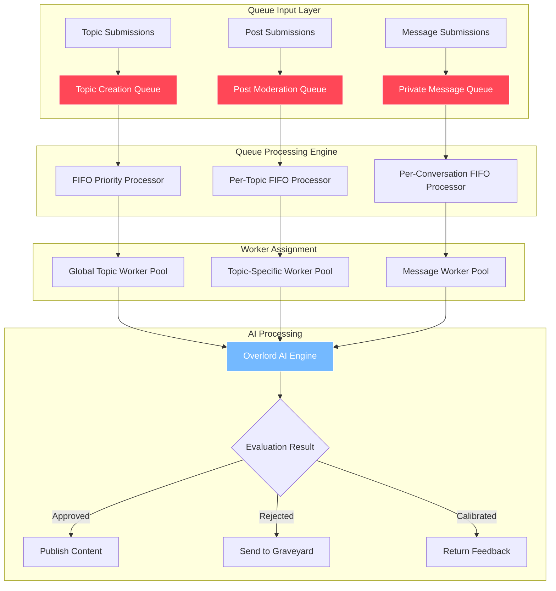
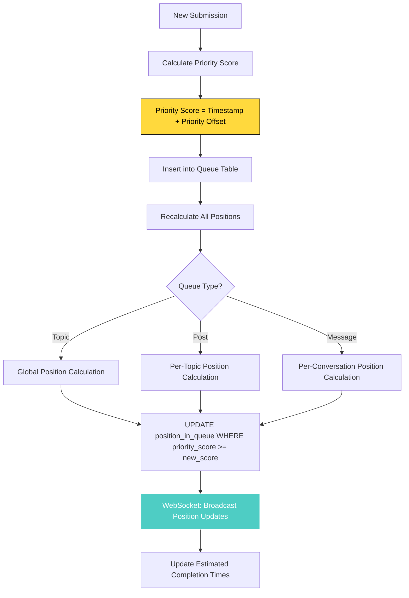
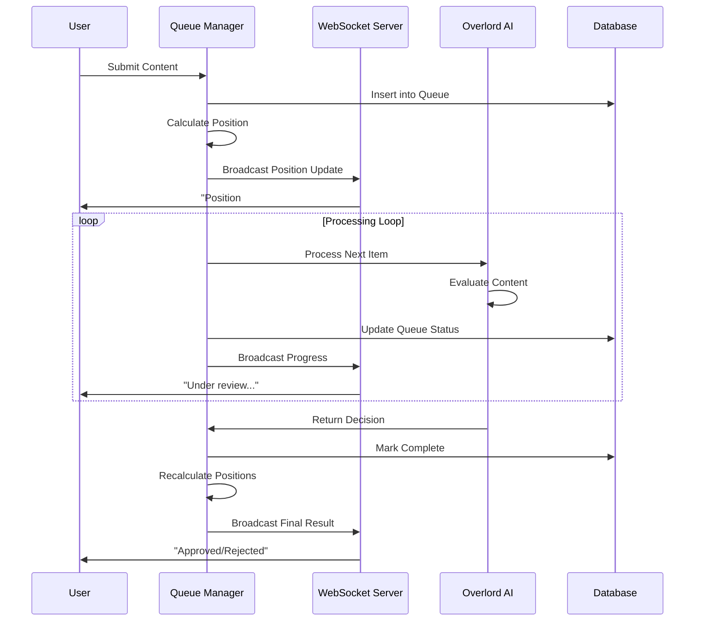

# Queue Management System

## Queue System Architecture



## Queue Position Calculation



## Real-time Queue Updates



## Queue Types

The Robot Overlord platform uses three specialized queues to handle different types of content moderation: parallel processing across contexts. The architecture uses:

- **1 Global Topics Queue**: All topic creation requests (strict FIFO)
- **N Posts Queues**: One queue per topic for posts/replies (strict FIFO within each topic)
- **N Message Queues**: One queue per conversation for private messages (strict FIFO within each conversation)

## Configuration

```python
QUEUE_CONFIG = {
    'total_workers': 3,  # One per queue type minimum
    'worker_distribution': {
        'global_topics': {'min': 1, 'max': 1},           # Always ensure topic approval
        'posts_per_topic': {'min': 1, 'max': 10},        # Scale based on active topics
        'messages_per_conversation': {'min': 1, 'max': 5} # Scale based on active conversations
    },
    'circuit_breaker_threshold': timedelta(minutes=2),
    'configurable_scaling': True,
    'ordering_strategy': {
        'topics': 'strict_fifo_global',              # Global FIFO for all topics
        'posts': 'strict_fifo_per_topic',            # FIFO within each topic
        'private_messages': 'strict_fifo_per_conversation'  # FIFO within each conversation
    }
}
```

## Queue Orchestrator

```python
class QueueOrchestrator:
    def __init__(self, total_workers: int = 3):
        self.total_workers = total_workers
        self.worker_pool = WorkerPool(total_workers)
        self.active_queues = {
            'global_topics': TopicsQueue(),
            'posts_queues': {},      # topic_id -> PostsQueue
            'message_queues': {}     # conversation_id -> MessagesQueue
        }
        self.circuit_breaker_threshold = timedelta(minutes=2)
    
    async def distribute_workers(self):
        """Distribute workers across queue contexts"""
        # Always ensure global topics queue has a worker
        await self.assign_worker_to_queue('global_topics', priority=True)
        
        # Assign workers to active posts queues (one worker per topic queue)
        active_topic_queues = await self.get_active_posts_queues()
        for topic_id in active_topic_queues:
            if self.has_available_worker():
                await self.assign_worker_to_posts_queue(topic_id)
        
        # Assign workers to active message queues (one worker per conversation queue)
        active_message_queues = await self.get_active_message_queues()
        for conversation_id in active_message_queues:
            if self.has_available_worker():
                await self.assign_worker_to_message_queue(conversation_id)
    
    async def create_posts_queue(self, topic_id: str):
        """Create new posts queue for a topic"""
        if topic_id not in self.active_queues['posts_queues']:
            self.active_queues['posts_queues'][topic_id] = PostsQueue(topic_id)
            await self.assign_worker_to_posts_queue(topic_id)
    
    async def create_message_queue(self, conversation_id: str):
        """Create new message queue for a conversation"""
        if conversation_id not in self.active_queues['message_queues']:
            self.active_queues['message_queues'][conversation_id] = MessagesQueue(conversation_id)
            await self.assign_worker_to_message_queue(conversation_id)
    
    async def get_queue_priority_score(self, queue_name: str) -> int:
        """Calculate priority score for worker allocation"""
        queue_length = await self.get_queue_length(queue_name)
        avg_wait_time = await self.get_average_wait_time(queue_name)
        
        # Higher score = higher priority
        return queue_length * 10 + int(avg_wait_time.total_seconds() / 60)
```

## Queue Processing Strategies

### Strict FIFO Processing Within Contexts

```python
class TopicsQueue:
    """Global topics queue - strict FIFO for all topic creation"""
    
    async def process(self):
        while True:
            # Process one topic at a time in strict order
            next_topic = await redis.lpop('global_topics')
            if not next_topic:
                await asyncio.sleep(1)
                continue
            
            await process_topic_moderation(next_topic)
            await update_queue_visualization('global_topics')

class PostsQueue:
    """Per-topic posts queue - strict FIFO within each topic"""
    
    def __init__(self, topic_id: str):
        self.topic_id = topic_id
        self.queue_name = f"posts_topic_{topic_id}"
    
    async def process(self):
        while True:
            # Process one post at a time for this topic in strict order
            next_post = await redis.lpop(self.queue_name)
            if not next_post:
                await asyncio.sleep(1)
                continue
            
            await process_post_moderation(next_post, self.topic_id)
            await update_queue_visualization(self.queue_name)

class MessagesQueue:
    """Per-conversation messages queue - strict FIFO within each conversation"""
    
    def __init__(self, conversation_id: str):
        self.conversation_id = conversation_id
        self.queue_name = f"messages_conv_{conversation_id}"
    
    async def process(self):
        while True:
            # Process one message at a time for this conversation in strict order
            next_message = await redis.lpop(self.queue_name)
            if not next_message:
                await asyncio.sleep(1)
                continue
            
            await process_message_moderation(next_message, self.conversation_id)
            await update_queue_visualization(self.queue_name)
```

### Parallel Processing Across Contexts

```python
async def start_queue_processing():
    """Start all queue processors in parallel"""
    
    # Start global topics processor
    topics_task = asyncio.create_task(
        TopicsQueue().process()
    )
    
    # Start processors for active topic queues
    posts_tasks = []
    for topic_id in await get_active_topics():
        posts_queue = PostsQueue(topic_id)
        posts_tasks.append(asyncio.create_task(posts_queue.process()))
    
    # Start processors for active conversation queues  
    message_tasks = []
    for conversation_id in await get_active_conversations():
        messages_queue = MessagesQueue(conversation_id)
        message_tasks.append(asyncio.create_task(messages_queue.process()))
    
    # Run all processors in parallel
    await asyncio.gather(
        topics_task,
        *posts_tasks,
        *message_tasks
    )
```

---

**Related Documentation:**
- [Real-time Streaming](./06-realtime-streaming.md) - Queue visualization updates
- [Background Processing](./11-background-processing.md) - Worker implementation
- [Business: Posts & Moderation](../business-requirements/07-posts-moderation.md) - Queue requirements
