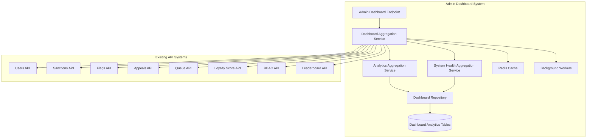

# Admin Dashboard System - Technical Design

## Overview

The Admin Dashboard provides comprehensive administrative and moderation capabilities for The Robot Overlord platform. Rather than creating duplicate APIs, this system **aggregates data from existing endpoints** and enhances them with admin-specific functionality. This approach avoids API overlap while providing a unified administrative interface.

## Architecture

### System Components



## Database Models

### Dashboard Analytics Models

```python
class DashboardSnapshot(BaseDBModel):
    """Periodic snapshots of dashboard metrics for historical tracking."""
    snapshot_type: DashboardSnapshotType
    metrics_data: dict[str, Any]
    period_start: datetime
    period_end: datetime
    generated_at: datetime = Field(default_factory=datetime.utcnow)

class DashboardSnapshotType(str, Enum):
    HOURLY = "hourly"
    DAILY = "daily"
    WEEKLY = "weekly"
    MONTHLY = "monthly"

class DashboardOverview(BaseModel):
    """Aggregated dashboard overview data."""
    user_metrics: UserActivitySummary
    content_metrics: ContentActivitySummary
    moderation_metrics: ModerationActivitySummary
    system_health: SystemHealthSummary
    recent_activity: list[RecentActivity]
    generated_at: datetime

class UserActivitySummary(BaseModel):
    """User activity summary from existing user/loyalty systems."""
    total_users: int
    active_users_24h: int
    active_users_7d: int
    new_registrations_24h: int
    banned_users: int
    sanctioned_users: int
    top_contributors: list[UserSummary]

class ContentActivitySummary(BaseModel):
    """Content activity summary from existing content systems."""
    posts_created_24h: int
    posts_approved_24h: int
    posts_rejected_24h: int
    topics_created_24h: int
    flags_submitted_24h: int
    appeals_submitted_24h: int
    moderation_queue_size: int

class ModerationActivitySummary(BaseModel):
    """Moderation activity summary from existing moderation systems."""
    flags_pending: int
    appeals_pending: int
    sanctions_applied_24h: int
    moderator_actions_24h: int
    queue_processing_times: dict[str, float]

class SystemHealthSummary(BaseModel):
    """System health summary from existing health endpoints."""
    overall_status: str
    database_healthy: bool
    redis_healthy: bool
    queue_healthy: bool
    worker_status: dict[str, str]
    response_time_avg: float

class RecentActivity(BaseModel):
    """Recent administrative activity."""
    activity_type: str
    description: str
    user_id: UUID | None = None
    moderator_id: UUID | None = None
    timestamp: datetime
```

### Admin Activity Tracking

```python
class AdminAction(BaseDBModel):
    """Track administrative actions for audit trail."""
    admin_pk: UUID
    action_type: AdminActionType
    target_type: str  # user, post, topic, etc.
    target_pk: UUID | None = None
    description: str
    metadata: dict[str, Any] = {}
    ip_address: str | None = None

class AdminActionType(str, Enum):
    DASHBOARD_ACCESS = "dashboard_access"
    USER_ROLE_CHANGE = "user_role_change"
    USER_BAN = "user_ban"
    USER_UNBAN = "user_unban"
    SANCTION_APPLY = "sanction_apply"
    SANCTION_REMOVE = "sanction_remove"
    CONTENT_RESTORE = "content_restore"
    CONTENT_DELETE = "content_delete"
    APPEAL_DECISION = "appeal_decision"
    FLAG_DECISION = "flag_decision"
    SYSTEM_CONFIG = "system_config"
    BULK_ACTION = "bulk_action"

class SystemAnnouncement(BaseDBModel):
    """System-wide announcements."""
    title: str
    content: str
    announcement_type: AnnouncementType
    created_by_pk: UUID
    is_active: bool = True
    expires_at: datetime | None = None
    target_roles: list[UserRole] = []

class AnnouncementType(str, Enum):
    MAINTENANCE = "maintenance"
    FEATURE_UPDATE = "feature_update"
    POLICY_CHANGE = "policy_change"
    GENERAL = "general"
    EMERGENCY = "emergency"
```

## API Strategy: Aggregation Over Duplication

### Core Principle
Instead of creating duplicate admin endpoints, we **enhance existing APIs** and create a **single dashboard aggregation endpoint** that pulls data from all existing systems.

### Key Changes to Existing APIs

#### 1. Enhanced User Management (Existing `/api/v1/users/`)
```python
# Add admin_details parameter to existing endpoints
@router.get("/users")
async def get_users(
    # ... existing parameters ...
    admin_details: Annotated[bool, Query()] = False,  # NEW
) -> UserListResponse:
    """Enhanced to include admin fields when requested by admin users."""
```

#### 2. Enhanced Health Check (Existing `/health`)
```python
@router.get("/health")
async def health_check(
    detailed: Annotated[bool, Query()] = False,  # NEW
) -> HealthResponse:
    """Enhanced with detailed system metrics for admins."""
```

### New Dashboard Endpoint

```python
@router.get("/api/v1/admin/dashboard")
async def get_admin_dashboard(
    current_user: Annotated[User, Depends(require_admin)],
    period: Annotated[str, Query()] = "24h",
    dashboard_service: Annotated[DashboardService, Depends(get_dashboard_service)],
) -> DashboardOverview:
    """Single endpoint that aggregates data from all existing systems."""
    
    await dashboard_service.log_admin_action(
        admin_pk=current_user.pk,
        action_type=AdminActionType.DASHBOARD_ACCESS,
        description="Admin dashboard accessed",
    )
    
    return await dashboard_service.get_dashboard_overview(period)
```

### Additional Admin-Only Endpoints

```python
@router.post("/api/v1/admin/announcements")
async def create_announcement(
    announcement: AnnouncementCreate,
    current_user: Annotated[User, Depends(require_admin)],
    dashboard_service: Annotated[DashboardService, Depends(get_dashboard_service)],
) -> SystemAnnouncement:
    """Create system announcement."""
    
    return await dashboard_service.create_announcement(announcement, current_user.pk)

@router.get("/api/v1/admin/announcements")
async def get_announcements(
    current_user: Annotated[User, Depends(require_admin)],
    active_only: Annotated[bool, Query()] = True,
    dashboard_service: Annotated[DashboardService, Depends(get_dashboard_service)],
) -> list[SystemAnnouncement]:
    """Get system announcements."""
    
    return await dashboard_service.get_announcements(active_only)

@router.get("/api/v1/admin/audit-log")
async def get_audit_log(
    current_user: Annotated[User, Depends(require_admin)],
    limit: Annotated[int, Query(le=100, ge=1)] = 50,
    offset: Annotated[int, Query(ge=0)] = 0,
    dashboard_service: Annotated[DashboardService, Depends(get_dashboard_service)],
) -> AuditLogResponse:
    """Get admin action audit log."""
    
    return await dashboard_service.get_audit_log(limit, offset)
```

## Existing API Integration

### No New Moderation Endpoints Needed
The dashboard leverages existing moderation APIs:
- **`/api/v1/queue/`** - Queue management (already admin-accessible)
- **`/api/v1/flags/`** - Flag management (already admin-accessible) 
- **`/api/v1/appeals/`** - Appeal management (already admin-accessible)
- **`/api/v1/sanctions/`** - Sanction management (already admin-accessible)

### No New Analytics Endpoints Needed
The dashboard aggregates from existing analytics:
- **`/api/v1/leaderboard/stats`** - User engagement metrics
- **`/api/v1/loyalty-score/events/recent`** - Moderation activity
- **`/api/v1/flags/stats/user/{user_id}`** - Flag statistics
- **`/api/v1/queue/health`** - Queue performance

## Service Layer

### DashboardService (Data Aggregation)

```python
class DashboardService:
    """Service for aggregating dashboard data from existing systems."""
    
    def __init__(self):
        # Use existing services instead of creating new ones
        self.user_service = UserService()
        self.sanction_service = SanctionService()
        self.flag_service = FlagService()
        self.appeal_service = AppealService()
        self.queue_service = QueueService()
        self.loyalty_service = LoyaltyScoreService()
        self.leaderboard_service = LeaderboardService()
        
        # New components for dashboard-specific functionality
        self.dashboard_repository = DashboardRepository()
        self.admin_action_repository = AdminActionRepository()
    
    async def get_dashboard_overview(self, period: str = "24h") -> DashboardOverview:
        """Aggregate dashboard data from all existing systems."""
        
        # Aggregate user metrics from existing user/loyalty systems
        user_metrics = await self._aggregate_user_metrics(period)
        
        # Aggregate content metrics from existing content systems
        content_metrics = await self._aggregate_content_metrics(period)
        
        # Aggregate moderation metrics from existing moderation systems
        moderation_metrics = await self._aggregate_moderation_metrics(period)
        
        # Aggregate system health from existing health endpoints
        system_health = await self._aggregate_system_health()
        
        # Get recent activity from audit log
        recent_activity = await self._get_recent_activity()
        
        return DashboardOverview(
            user_metrics=user_metrics,
            content_metrics=content_metrics,
            moderation_metrics=moderation_metrics,
            system_health=system_health,
            recent_activity=recent_activity,
            generated_at=datetime.utcnow(),
        )
    
    async def _aggregate_user_metrics(self, period: str) -> UserActivitySummary:
        """Aggregate user metrics from existing user and loyalty systems."""
        # Use existing user service and loyalty service
        # No duplicate data access - leverage existing methods
        
    async def _aggregate_content_metrics(self, period: str) -> ContentActivitySummary:
        """Aggregate content metrics from existing content systems."""
        # Use existing post, topic, flag, appeal services
        
    async def _aggregate_moderation_metrics(self, period: str) -> ModerationActivitySummary:
        """Aggregate moderation metrics from existing moderation systems."""
        # Use existing sanction, flag, appeal, queue services
        
    async def _aggregate_system_health(self) -> SystemHealthSummary:
        """Aggregate system health from existing health checks."""
        # Use existing health check methods
        
    async def log_admin_action(
        self,
        admin_pk: UUID,
        action_type: AdminActionType,
        description: str,
        target_type: str | None = None,
        target_pk: UUID | None = None,
        metadata: dict[str, Any] | None = None,
        ip_address: str | None = None,
    ) -> AdminAction:
        """Log administrative action for audit trail."""
        
        action = AdminActionCreate(
            admin_pk=admin_pk,
            action_type=action_type,
            target_type=target_type,
            target_pk=target_pk,
            description=description,
            metadata=metadata or {},
            ip_address=ip_address,
        )
        
        return await self.admin_action_repository.create(action)
```

## Repository Layer

### DashboardRepository

```python
class DashboardRepository(BaseRepository[DashboardSnapshot]):
    """Repository for dashboard snapshot storage and retrieval."""
    
    async def create_snapshot(
        self, 
        snapshot: DashboardSnapshotCreate
    ) -> DashboardSnapshot:
        """Store dashboard metrics snapshot."""
        
    async def get_snapshots_by_period(
        self,
        snapshot_type: DashboardSnapshotType,
        start_date: datetime,
        end_date: datetime,
    ) -> list[DashboardSnapshot]:
        """Get historical snapshots for trend analysis."""

class AdminActionRepository(BaseRepository[AdminAction]):
    """Repository for admin action audit trail."""
    
    async def create_action(self, action: AdminActionCreate) -> AdminAction:
        """Log administrative action."""
        
    async def get_actions_by_admin(
        self,
        admin_pk: UUID,
        limit: int = 50,
        offset: int = 0,
    ) -> list[AdminAction]:
        """Get actions performed by specific admin."""
        
    async def get_recent_actions(
        self,
        limit: int = 50,
        offset: int = 0,
    ) -> list[AdminAction]:
        """Get recent administrative actions."""

class SystemAnnouncementRepository(BaseRepository[SystemAnnouncement]):
    """Repository for system announcements."""
    
    async def create_announcement(
        self, 
        announcement: AnnouncementCreate
    ) -> SystemAnnouncement:
        """Create system announcement."""
        
    async def get_active_announcements(self) -> list[SystemAnnouncement]:
        """Get currently active announcements."""
```
## Integration with Existing Codebase

### ✅ **Existing Infrastructure Alignment**

1. **Authentication & Authorization**
   - Uses existing `require_admin` and `require_superadmin` dependencies from `/auth/dependencies.py`
   - Leverages existing role hierarchy: `CITIZEN < MODERATOR < ADMIN < SUPERADMIN`
   - Integrates with existing `AuthenticationMiddleware`

2. **Database Patterns**
   - Follows existing `BaseDBModel` pattern with `pk`, `created_at`, `updated_at`
   - Uses existing `BaseRepository[T]` pattern for data access
   - Follows existing enum patterns (`UserRole`, `ContentStatus`, etc.)

3. **Service Layer Integration**
   - Reuses existing services: `UserService`, `SanctionService`, `FlagService`, etc.
   - Follows existing dependency injection patterns
   - Uses existing service initialization patterns

4. **API Router Integration**
   - Integrates with existing FastAPI router structure in `/main.py`
   - Follows existing endpoint patterns and response models
   - Uses existing error handling and HTTP status codes

### 🔄 **Enhanced Data Flow with Existing Services**

```
Frontend Dashboard Request
    ↓
/api/v1/admin/dashboard (NEW)
    ↓
DashboardService.get_dashboard_overview() (NEW)
    ↓
Parallel calls to EXISTING services:
    - UserService.get_user_stats()
    - SanctionService.get_recent_sanctions()
    - FlagService.get_flag_statistics()
    - AppealService.get_appeal_metrics()
    - QueueService.get_queue_health()
    - LoyaltyScoreService.get_engagement_metrics()
    ↓
Aggregate into DashboardOverview (NEW)
    ↓
Cache result in Redis (existing pattern)
    ↓
Return to frontend
```

### 🏗️ **File Structure Integration**

```
therobotoverlord-api/src/therobotoverlord_api/
├── api/
│   ├── admin.py                    # NEW - Dashboard endpoint
│   ├── users.py                    # ENHANCED - Add admin_details param
│   └── [existing APIs unchanged]
├── database/models/
│   ├── admin_action.py            # NEW - Audit trail
│   ├── dashboard_snapshot.py      # NEW - Historical data
│   ├── system_announcement.py     # NEW - Announcements
│   └── [existing models unchanged]
├── database/repositories/
│   ├── admin_action.py            # NEW
│   ├── dashboard.py               # NEW
│   ├── system_announcement.py     # NEW
│   └── [existing repos unchanged]
├── services/
│   ├── dashboard_service.py       # NEW - Data aggregation
│   └── [existing services unchanged]
└── main.py                        # ENHANCED - Add admin router
```

### 🔌 **Dependency Injection Pattern**

```python
# Follows existing pattern from other services
async def get_dashboard_service() -> DashboardService:
    """Dependency injection for dashboard service."""
    return DashboardService()

# Used in endpoints exactly like existing services
@router.get("/api/v1/admin/dashboard")
async def get_admin_dashboard(
    current_user: Annotated[User, Depends(require_admin)],
    dashboard_service: Annotated[DashboardService, Depends(get_dashboard_service)],
) -> DashboardOverview:
    """Follows exact same pattern as existing endpoints."""
```

### 📊 **Cache Integration**

```python
# Uses existing Redis patterns from other services
class DashboardService:
    CACHE_KEY_PREFIX = "admin_dashboard"  # Follows existing naming
    CACHE_TTL = 300  # 5 minutes, consistent with other services
    
    async def get_dashboard_overview(self, period: str) -> DashboardOverview:
        cache_key = f"{self.CACHE_KEY_PREFIX}:{period}"
        
        # Use existing Redis connection pattern
        cached = await redis.get(cache_key)
        if cached:
            return DashboardOverview.model_validate_json(cached)
            
        # Generate fresh data, cache, and return
        overview = await self._generate_overview(period)
        await redis.setex(cache_key, self.CACHE_TTL, overview.model_dump_json())
        return overview
```

## Implementation Benefits

### ✅ **Advantages of Integrated Approach**

1. **Zero API Duplication** - Leverages existing, tested endpoints
2. **Consistent Patterns** - Uses established codebase conventions
3. **Minimal Code Changes** - Only adds new functionality, doesn't modify existing
4. **Existing Authorization** - Reuses proven RBAC implementation
5. **Performance Optimized** - Builds on existing caching strategies

## Next Steps

1. **Database Models** - Add 3 new models following existing patterns
2. **Repositories** - Create 3 new repositories extending `BaseRepository[T]`
3. **Dashboard Service** - Build aggregation service using existing services
4. **Admin API Router** - Single new router with 3 endpoints
5. **Main.py Integration** - Add admin router to existing router list
6. **Background Workers** - Optional: Add snapshot generation worker

### SystemHealthService

```python
class SystemHealthService:
    """Service for monitoring system health."""
    
    async def get_comprehensive_health(self) -> SystemHealthStatus:
        """Get complete system health status."""
        
    async def check_database_health(self) -> DatabaseHealth:
        """Check database connectivity and performance."""
        
    async def check_redis_health(self) -> RedisHealth:
        """Check Redis connectivity and performance."""
        
    async def check_worker_health(self) -> WorkerHealth:
        """Check background worker status."""
        
    async def get_performance_metrics(self, period: str) -> PerformanceMetrics:
        """Get system performance metrics."""
```

## Repository Layer

### AdminRepository

```python
class AdminRepository(BaseRepository[AdminAction]):
    """Repository for admin actions and audit trail."""
    
    async def log_admin_action(self, action: AdminActionCreate) -> AdminAction:
        """Log administrative action for audit trail."""
        
    async def get_admin_actions(
        self, 
        filters: AdminActionFilters,
        pagination: PaginationParams
    ) -> list[AdminAction]:
        """Get filtered admin actions."""
        
    async def get_user_admin_history(self, user_id: UUID) -> list[AdminAction]:
        """Get admin actions performed on specific user."""
```

### AnalyticsRepository

```python
class AnalyticsRepository:
    """Repository for analytics data aggregation."""
    
    async def get_user_activity_metrics(self, period: str) -> UserActivityMetrics:
        """Aggregate user activity metrics."""
        
    async def get_content_metrics(self, period: str) -> ContentMetrics:
        """Aggregate content creation metrics."""
        
    async def get_moderation_metrics(self, period: str) -> ModerationMetrics:
        """Aggregate moderation activity metrics."""
        
    async def store_analytics_snapshot(self, analytics: SystemAnalytics) -> None:
        """Store analytics snapshot for historical tracking."""
```

## Database Schema

### Admin Actions Table

```sql
CREATE TABLE admin_actions (
    pk UUID PRIMARY KEY DEFAULT gen_random_uuid(),
    admin_pk UUID NOT NULL REFERENCES users(pk) ON DELETE CASCADE,
    action_type VARCHAR(50) NOT NULL,
    target_type VARCHAR(50),
    target_pk UUID,
    description TEXT NOT NULL,
    metadata JSONB DEFAULT '{}',
    ip_address INET,
    created_at TIMESTAMP WITH TIME ZONE DEFAULT NOW()
);

CREATE INDEX idx_admin_actions_admin_pk ON admin_actions(admin_pk);
CREATE INDEX idx_admin_actions_action_type ON admin_actions(action_type);
CREATE INDEX idx_admin_actions_target ON admin_actions(target_type, target_pk);
CREATE INDEX idx_admin_actions_created_at ON admin_actions(created_at);
```

### System Analytics Table

```sql
CREATE TABLE system_analytics (
    pk UUID PRIMARY KEY DEFAULT gen_random_uuid(),
    metric_name VARCHAR(100) NOT NULL,
    metric_value DECIMAL(15,4) NOT NULL,
    metric_type VARCHAR(50) NOT NULL,
    period_start TIMESTAMP WITH TIME ZONE NOT NULL,
    period_end TIMESTAMP WITH TIME ZONE NOT NULL,
    metadata JSONB DEFAULT '{}',
    created_at TIMESTAMP WITH TIME ZONE DEFAULT NOW()
);

CREATE INDEX idx_system_analytics_metric_name ON system_analytics(metric_name);
CREATE INDEX idx_system_analytics_metric_type ON system_analytics(metric_type);
CREATE INDEX idx_system_analytics_period ON system_analytics(period_start, period_end);
```

### System Announcements Table

```sql
CREATE TABLE system_announcements (
    pk UUID PRIMARY KEY DEFAULT gen_random_uuid(),
    title VARCHAR(200) NOT NULL,
    content TEXT NOT NULL,
    announcement_type VARCHAR(50) NOT NULL,
    created_by_pk UUID NOT NULL REFERENCES users(pk) ON DELETE CASCADE,
    is_active BOOLEAN DEFAULT TRUE,
    expires_at TIMESTAMP WITH TIME ZONE,
    target_roles TEXT[] DEFAULT '{}',
    created_at TIMESTAMP WITH TIME ZONE DEFAULT NOW(),
    updated_at TIMESTAMP WITH TIME ZONE DEFAULT NOW()
);

CREATE INDEX idx_system_announcements_active ON system_announcements(is_active);
CREATE INDEX idx_system_announcements_expires_at ON system_announcements(expires_at);
CREATE INDEX idx_system_announcements_type ON system_announcements(announcement_type);
```

## Caching Strategy

### Redis Cache Keys

```python
CACHE_KEYS = {
    "dashboard_overview": "admin:dashboard:overview",
    "user_metrics": "admin:metrics:users:{period}",
    "content_metrics": "admin:metrics:content:{period}",
    "system_health": "admin:health:system",
    "worker_status": "admin:workers:status",
    "moderation_queue": "admin:moderation:queue:{type}",
}

CACHE_TTL = {
    "dashboard_overview": 300,  # 5 minutes
    "metrics": 600,  # 10 minutes
    "system_health": 60,  # 1 minute
    "worker_status": 30,  # 30 seconds
    "moderation_queue": 120,  # 2 minutes
}
```

## Security & Authorization

### Role-Based Access Control

```python
def require_admin(current_user: User = Depends(get_current_user)) -> User:
    """Require Admin or Super Admin role."""
    if current_user.role not in [UserRole.ADMIN, UserRole.SUPERADMIN]:
        raise HTTPException(
            status_code=status.HTTP_403_FORBIDDEN,
            detail="Admin access required"
        )
    return current_user

def require_superadmin(current_user: User = Depends(get_current_user)) -> User:
    """Require Super Admin role."""
    if current_user.role != UserRole.SUPERADMIN:
        raise HTTPException(
            status_code=status.HTTP_403_FORBIDDEN,
            detail="Super Admin access required"
        )
    return current_user
```

### Audit Trail

All administrative actions are logged with:
- Admin user ID
- Action type and description
- Target resource (user, post, etc.)
- Timestamp and IP address
- Metadata for context

## Performance Considerations

### Database Optimization

- Materialized views for complex analytics queries
- Proper indexing on frequently queried columns
- Query optimization for large datasets
- Connection pooling for concurrent requests

### Caching Strategy

- Redis caching for frequently accessed metrics
- Cache invalidation on data updates
- Tiered caching for different data types
- Background cache warming

### Pagination

- Cursor-based pagination for large datasets
- Configurable page sizes with limits
- Efficient counting queries
- Index optimization for sorting

## Background Workers

### Analytics Worker

```python
async def analytics_aggregation_worker(ctx: dict) -> None:
    """Aggregate analytics data periodically."""
    # Run every hour to aggregate metrics
    # Store in system_analytics table
    # Update cached dashboard data
```

### Health Monitoring Worker

```python
async def health_monitoring_worker(ctx: dict) -> None:
    """Monitor system health continuously."""
    # Check database, Redis, workers
    # Alert on critical issues
    # Update health status cache
```

## Integration Points

### Existing Systems

- **RBAC System**: Role and permission management
- **Sanctions System**: User moderation enforcement
- **Queue System**: Moderation queue monitoring
- **Loyalty System**: User engagement metrics
- **Flag System**: Content moderation workflow
- **Appeal System**: Appeal management

### External Dependencies

- Database health monitoring
- Redis connectivity
- Background worker status
- System performance metrics

## Implementation Plan

### Phase 1: Core Infrastructure
1. Database models and migrations
2. Basic repository layer
3. Core service implementations
4. Authentication and authorization

### Phase 2: Dashboard APIs
1. Dashboard overview endpoint
2. User management endpoints
3. System health endpoints
4. Basic analytics endpoints

### Phase 3: Advanced Features
1. Comprehensive analytics
2. System configuration
3. Audit trail management
4. Performance monitoring

### Phase 4: Optimization
1. Caching implementation
2. Background workers
3. Performance tuning
4. Security hardening

## Testing Strategy

### Unit Tests
- Service layer business logic
- Repository data access
- Model validation
- Permission checking

### Integration Tests
- API endpoint functionality
- Database operations
- Cache operations
- External system integration

### Performance Tests
- Dashboard load times
- Analytics query performance
- Concurrent user handling
- Cache effectiveness

## Monitoring & Observability

### Metrics to Track
- Dashboard response times
- Analytics query performance
- Admin action frequency
- System health status
- Cache hit rates

### Logging
- All admin actions
- System health changes
- Performance issues
- Security events

### Alerting
- System health degradation
- Performance threshold breaches
- Security incidents
- Critical errors

This comprehensive admin dashboard system provides the necessary tools for effective platform administration while maintaining security, performance, and auditability.
